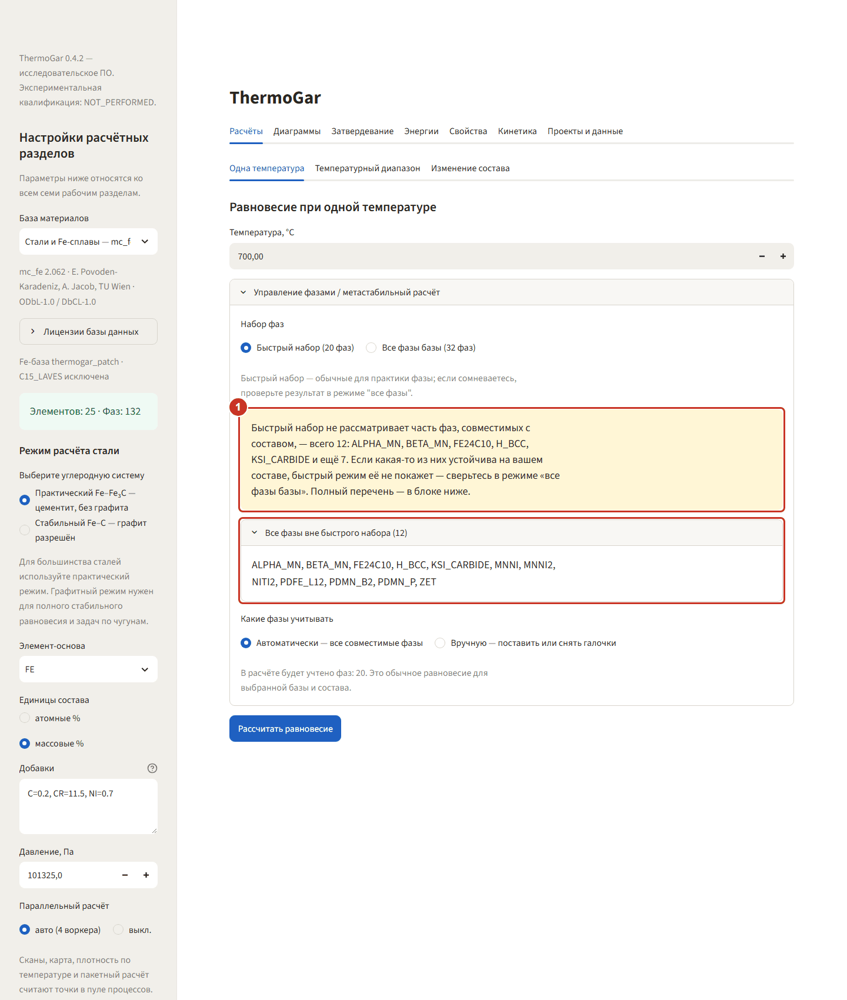
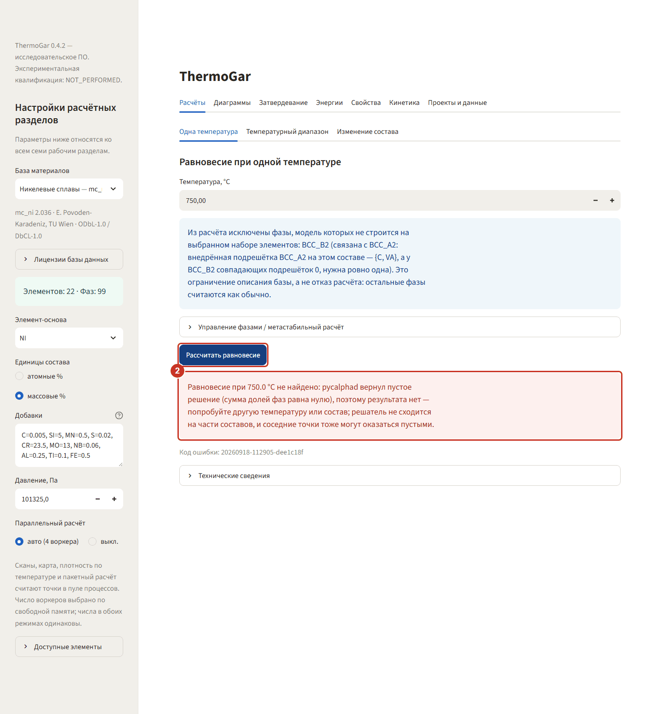

# ThermoGar 0.4.3 — руководство пользователя

## 1. Что это такое

ThermoGar считает фазовые равновесия в сплавах методом CALPHAD: по составу,
температуре и давлению находит, какие фазы устойчивы, сколько их и из чего
они состоят. На этой основе строятся диаграммы состояния, кривые
затвердевания, кривые энергии, оценки плотности и упругих свойств, а также
кинетика диффузии и выделений.

Приложение работает локально: расчёт идёт на вашем компьютере, интернет не
нужен, данные никуда не отправляются. Интерфейс открывается в браузере,
но это не сайт — окно браузера служит только окном программы.

> **Исследовательское программное обеспечение.** Сверка с измеренным
> проведена на трёх случаях: качественно база права, количественно доли фаз
> промахиваются в 1,6…2,6 раза — доли фаз следует считать оценкой, а не
> измерением (см. docs/LIMITS_OF_APPLICABILITY.md). Результат — следствие
> выбранной термодинамической модели и введённых параметров; он не заменяет
> аттестацию материала и не является основанием для производственного
> решения. Стальная база поставляется как патч `TG-FE-2062-C15-001` с
> исключённой фазой `C15_LAVES`.

> **Что метод показать не может.** ThermoGar считает объёмную термодинамику. О
> том, что происходит на границах зёрен и на межфазных поверхностях —
> смачивание границ жидкостью, сегрегация на границы, поверхностное натяжение,
> зарождение на дефектах, — расчёт не говорит ничего. Поэтому **отсутствие
> эффекта в расчёте не является доказательством отсутствия эффекта в металле**.
> Прочитайте [«Границы применимости расчёта»](docs/LIMITS_OF_APPLICABILITY.md)
> прежде, чем делать по результату вывод вида «этого можно не опасаться»: там
> разобрано, как такой вывод однажды был сделан и почему его пришлось снять.
> Там же — про элементы, которых нет в базе: они не «учтены приближённо», они
> не участвуют в расчёте вообще.

## 2. Три базы

| Пункт в боковой панели | База | Что покрывает |
|---|---|---|
| Никелевые сплавы | mc_ni 2.036 | жаропрочные Ni-сплавы, γ/γ′, карбиды, топологически плотные фазы |
| Алюминиевые сплавы | mc_al 2.037 | деформируемые и литейные Al-сплавы, θ, S-фаза, зоны Гинье–Престона |
| Стали и Fe-сплавы | mc_fe 2.062 + патч | углеродистые и легированные стали, карбиды M₂₃C₆, M₇C₃, M₆C, цементит |

Базы — открытые сборки MatCalc (TU Wien) для некоммерческого
исследовательского и учебного применения; условия — в заголовках самих
`.tdb` и в `THIRD_PARTY_NOTICES.txt`.

Смена базы в боковой панели сбрасывает готовые результаты: состав и настройки
одной базы не переносятся на другую.

### Имена фаз матрицы

pycalphad оставляет упорядоченную половину пары «порядок/беспорядок», поэтому
матричная фаза в таблицах называется не всегда привычно:

| База | Матрица в результатах | Что это |
|---|---|---|
| Никелевые сплавы | `FCC_A1` | γ, ГЦК-твёрдый раствор |
| Алюминиевые сплавы | `GP_MAT` | связанная модель Al-матрицы и зон Гинье–Престона |
| Стали и Fe-сплавы | `BCC_B2` | феррит, связанная ОЦК-модель A2–B2 |

Это не ошибка расчёта: составы и доли физически разумны. В таблице фаз есть
колонка «Что это» с расшифровкой каждого имени.

## 3. Как ввести состав

В боковой панели задаются параметры, общие для всех семи разделов.

1. **База материалов** — одна из трёх.
2. **Режим расчёта стали** (только для Fe-базы): практический Fe–Fe₃C с
   цементитом и без графита — обычный выбор для сталей; стабильный Fe–C с
   графитом нужен для чугунов и полного стабильного равновесия.
3. **Элемент-основа** — элемент, который дополняет состав до 100 %.
4. **Единицы состава** — атомные или массовые проценты. Для сталей и
   алюминиевых сплавов обычно массовые.
5. **Добавки** — строка вида `ЭЛЕМЕНТ=ЧИСЛО`, пары через запятую:

   ```text
   C=0.2, CR=11.5, NI=0.7
   ```

   Разделитель дробной части — точка или запятая. Основу в добавках
   повторять не нужно. Сумма добавок должна быть меньше 100 %.
   Список доступных элементов раскрывается внизу боковой панели.
6. **Давление, Па** — по умолчанию 101 325.

Ошибка в составе показывается сразу и расчёт не запускает.

### Управление фазами

В каждом расчётном разделе есть свёрнутый блок «Управление фазами /
метастабильный расчёт» с двумя режимами:

- **Автоматически** — учитываются все фазы, совместимые с базой и составом.
  Это обычное равновесие; начинайте с него.
- **Вручную** — галочками можно снять фазы. Если снять устойчивую фазу,
  получится метастабильное равновесие среди оставшихся; такой результат
  нужно явно помечать как метастабильный.

Для стальной базы `C15_LAVES` в списке не появляется — она исключена патчем.

Отдельно задаётся **набор фаз**: «Быстрый набор» — список фаз, обычных для
практики, «Все фазы базы» — полный список. Быстрый набор считается заметно
быстрее, но он неполон по определению, поэтому программа прямо показывает, чего
в нём нет.

#### Три сообщения, которые не надо пропускать

**1. Фазы, не вошедшие в быстрый набор.** Быстрый режим называет совместимые
с вашим составом фазы, которых в наборе нет. Если какая-то из них на вашем
составе устойчива, быстрый режим её не покажет — и покажет вместо неё
качественно другую картину:



С версии 0.4.2 предупреждение называет число таких фаз и не больше пяти имён,
остальные сведены в «и ещё N». Например, для двадцати фаз:

> Быстрый набор не рассматривает часть фаз, совместимых с составом, — всего 20:
> A, B, C, D, E и ещё 15. Если какая-то из них устойчива на вашем составе,
> быстрый режим её не покажет — сверьтесь в режиме «все фазы базы». Полный
> перечень — в блоке ниже.

Полный перечень лежит в свёрнутом блоке «Все фазы вне быстрого набора (N)» под
предупреждением: раскройте его и проверьте, нет ли в списке фазы, которую вы
ожидаете на своём составе. Если фаз пять или меньше, все они названы в самом
предупреждении, и блока нет.

Проверять такие случаи следует переключением на «Все фазы базы». Для никелевых
сплавов Ni–Cr–Mo это особенно важно ниже 600 °C.

**2. Фазы, исключённые из расчёта, и причина.** Некоторые фазы базы не строятся
на выбранном наборе элементов — чаще всего это упорядоченная фаза, у которой
межузельная подрешётка не согласована с разупорядоченной. Такая фаза снимается,
расчёт продолжается, а сообщение называет фазу и причину:


Это ограничение описания базы, а не отказ расчёта. Но набор фаз при этом
формально неполон, и в отчёте об этом стоит упомянуть.

**3. Оценочная плотность.** В разделе «Свойства» плотность фаз, для которых в
физической базе нет прямой модели, оценивается по правилу смеси и помечается.
Рядом показывается, какую долю мольной доли фаз занимают такие фазы: если она
мала, на плотность сплава они практически не влияют, если велика — число следует
считать ориентировочным. На низких температурах у никелевых сплавов Ni–Cr–Mo
оценочной оказывается большая часть мольной доли фаз, потому что модели для
Ni₂Cr в физической базе нет вовсе, — такое число следует считать прикидкой.

Снимки первых двух сообщений сделаны на контрольном составе ХН62М при 400 °C;
файлы — в `docs\screenshots\`.

## 4. Семь рабочих разделов

### Расчёты

- **Одна температура** — фазы, их доли и составы в одной точке.
- **Температурный диапазон** — как меняются доли фаз при нагреве и охлаждении.
- **Изменение состава** — как меняются доли фаз при изменении содержания
  выбранного элемента.

Число точек скана задаётся минимумом, максимумом и шагом; действует лимит
150 точек за запуск.

**Равновесие не найдено.** На части составов решатель pycalphad возвращает
пустое решение: сумма долей фаз равна нулю. Тогда вместо таблицы появляется
красное сообщение, например:

> Равновесие при 750.0 °C не найдено: pycalphad вернул пустое решение (сумма
> долей фаз равна нулю), поэтому результата нет — попробуйте другую температуру
> или состав; решатель не сходится на части составов, и соседние точки тоже
> могут оказаться пустыми.



Это значит, что в этой точке решатель не сошёлся, а не что в сплаве нет фаз.
Числа за такую точку программа не подставляет. Попробуйте другую температуру
или состав. Малого сдвига может не хватить: пустое решение бывает сплошной
полосой — на сплаве ЭК199 без бора оно занимает 700…750 °C при Si 4,9…5 масс. %.
Скан на никелевой или алюминиевой базе, попав на такую точку, обрывается, и в
тексте ошибки названа её температура: сузьте диапазон так, чтобы её обойти.
Расчёт на стальной базе идёт другим путём; как он ведёт себя на пустом
решении, не проверялось.

### Диаграммы

- **Бинарная T–X** — классическая диаграмма состояния двух элементов.
- **Многокомпонентное T–X** — сечение по одному элементу при фиксированном
  содержании остальных.
- **Тройная при T = const** — изотермический треугольник трёх элементов.
- **Карта доли фазы** — доля выбранной фазы на плоскости двух составных осей.
  Система карты должна содержать ровно на один элемент больше, чем число
  осей, иначе решатель откажет: для двух осей это ровно три элемента.

Диаграммы — самая дорогая часть программы. Строятся по узлам сетки, шаг
задаётся вручную. Начинайте с грубого шага: результат появляется быстро,
и по нему видно, где сетку стоит сгущать.

### Затвердевание

Три варианта: только равновесное охлаждение, только Scheil–Gulliver или
сравнение обоих на одном графике. Равновесная модель предполагает полную
диффузию в твёрдом, Scheil — её отсутствие при полном перемешивании расплава;
реальный процесс лежит между ними. Оба метода считаются при 101 325 Па.

Интервал кристаллизации бывает узким: для Ni–15Al шаг по температуре в 30 K
проскакивает его целиком, нужны 5–10 K.

Расчёт по Шейлю обрывается, не доведя долю твёрдого до единицы: последние
проценты жидкости численно не разрешаются. Поэтому полученный интервал
кристаллизации — **оценка снизу**, и именно неразрешённый остаток отвечает за
легкоплавкие плёнки по границам. Подробнее —
[«Границы применимости расчёта»](docs/LIMITS_OF_APPLICABILITY.md).

### Энергии

- **Энергии фаз** — кривые минимальной мольной энергии Гиббса выбранных фаз
  по температуре.
- **Движущая сила** — разность энергий матрицы и выделяющейся фазы.
- **T₀** — температура, при которой энергии двух фаз при одном и том же
  составе сплава равны.

Окно температур для T₀ нужно брать узким вокруг ожидаемого перехода: на
широком окне разность перестаёт быть монотонной и корень не находится.
Пара «матрица / выделение» пересечения по температуре обычно не имеет —
этим способом строятся переходы «твёрдое / расплав» и «ОЦК / ГЦК».

### Свойства

- **Плотность** и **Плотность по T** — по равновесным составам фаз и
  физической базе `physical_data_v103.pdb`. Результат помечается статусом:
  прямая модель, оценка по связанной фазе или нет данных. Плотность сплава
  выводится только при полном покрытии всех равновесных фаз; для Al–Cu–Mg
  покрытие 98,9 % — нет модели `THETA_AL2CU`, и число не рассчитывается.
- **Упругие свойства** — гомогенизация Voigt–Reuss–Hill. Модуль Юнга и
  коэффициент Пуассона каждой фазы вводит пользователь вместе с источником:
  ThermoGar не выводит их из химического состава. Voigt и Reuss —
  идеализированные границы, Hill — их среднее.
- **Вклады упрочнения** — Hall–Petch, Taylor, Orowan, твёрдорастворный и
  произвольный внешний вклад. Включайте только те механизмы, для которых
  известны исходные коэффициенты. По умолчанию вклады не суммируются;
  итог не является пределом текучести, временным сопротивлением
  или твёрдостью.
- **Покрытие PDB** — какие равновесные фазы обеспечены физическими данными.

### Кинетика

- **Однофазная пара** — одномерная диффузия в диффузионной паре.
- **Многофазная гомогенизация** — локально-равновесная модель.
- **Покрытие базы подвижностей** — какие фазы несут данные о подвижности.
  Их немного: для Ni это `FCC_A1` и `NIAL`, для Al `FCC_A1`, для стали
  `BCC_A2` и `FCC_A1`.
- **Выделения** — кинетика KWN: зарождение, рост, растворение и укрупнение
  одной сферической фазы в однородной матрице.

Ограничения диффузии: одна пространственная координата, постоянная
температура, ступенчатый начальный профиль, нулевой поток на границах, не
более четырёх элементов одновременно (основа и три добавки).

Ограничения расчёта выделений: не более 10 добавок к основе. Это предел
измеренного, а не физический: больше 10 добавок расчёт не проверялся. При
составе длиннее четырёх добавок раздел предупреждает о времени: расчёт идёт
в этой же вкладке и не отменяется, каждая добавка удлиняет его примерно на
15 %. Если критический радиус зародыша меньше нижнего предела модели kawin,
раздел предупреждает: зарождение считается от предела, и начало выделения на
графиках может быть искажено. Если он меньше предела более чем в полтора раза,
расчёт не запускается: поднимите межфазную энергию либо температуру.

Предупреждения расчёта выделений выводятся над вкладками результата. Кроме
перечисленных выше, есть ещё два сообщения.

**Зародыш крупнее начальной сетки размеров.** Если оценка радиуса зародыша
больше поля «Начальный максимальный радиус», расчёт идёт, но выводится
предупреждение, например:

> Радиус зародыша 1.02 нм (оценка при 800.0 °C) больше начального максимального
> радиуса сетки 0.5 нм, поэтому первые зародыши записываются мельче своего
> размера, пока kawin не достроит сетку. Итоговые доля, радиус и число частиц
> от этого почти не меняются, но начало зарождения на графиках искажено: доля и
> радиус занижены, число частиц завышено. Задайте «Начальный максимальный
> радиус» больше 1.02 нм.

Итоговые числа от этого почти не меняются. Если нужно начало выделения, увеличьте «Начальный максимальный радиус», как
сказано в тексте, и пересчитайте.

**Расчёт остановлен: добавка вычерпана из матрицы.** Если по ходу счёта доля
какой-то добавки в матрице становится нулевой, расчёт останавливается,
показывает посчитанную часть и выводит над вкладками объяснение, например:

> Расчёт остановлен на 2.011 с модельного времени (0.0005586 ч): доля NB в
> матрице стала 0 ат. %, баланс масс нарушен. Показана часть расчёта до
> остановки. Причина: при движущей силе по базе зарождение практически
> безбарьерное, и выделение вычерпывает добавки из матрицы быстрее, чем модель
> это выдерживает; см. docs/LIMITS_OF_APPLICABILITY.md.

Если решатель pycalphad успевает упасть делением на ноль раньше, текст
начинается словами «Расчёт прерван после … с модельного времени» и называет
последний посчитанный состав матрицы. В обоих случаях строка «Состав матрицы
допустим» в таблице проверок отмечена ошибкой, а над вкладками стоит «Одна или
несколько внутренних проверок не пройдены.»


Остановка только прерывает расчёт: посчитанная часть та же, что была бы без
неё. Досчитать такой случай до конца программа не может — причина во входах, а
не в решателе: база даёт завышенную движущую силу, и зарождение идёт почти без
барьера. Так ведёт себя, например, Inconel 718 при 700 и 750 °C. Перезапуск с
теми же входами остановится так же. Разбор — в
[«Границах применимости расчёта»](docs/LIMITS_OF_APPLICABILITY.md), раздел
«Кинетика: обрыв расчёта и ошибка равновесия — один дефект».

Межфазная энергия, молярные объёмы,
плотность центров зарождения, размер зерна и плотность дислокаций задаются
пользователем и не калибруются автоматически — результат KWN настолько
достоверен, насколько достоверны эти числа.

### Проекты и данные

Описан в разделе 6.

## 5. Экспорт результатов

Под каждым результатом есть кнопки выгрузки:

- **Excel** — таблицы результата, по листу на таблицу;
- **CSV** — та же таблица одним файлом в UTF-8;
- **PNG** — график в том виде, в каком он на экране.

Кнопка сначала готовит файл, затем появляется вторая кнопка — собственно
скачивание. Файл попадает в папку загрузок браузера.

## 6. Библиотека, пакетный расчёт, проекты и история

### Марки и составы

Кнопка **Сохранить текущий состав** запоминает базу, основу, единицы, состав,
давление и режим стали под именем. Сохранённая запись загружается обратно в
боковую панель кнопкой **Загрузить состав в программу** — вместе со сменой
базы, если она другая. Библиотека выгружается в JSON и импортируется обратно
на другом компьютере. Учебные примеры помечены отдельно и не удаляются.

### Пакетный расчёт

Один файл — много составов, по строке на состав и температуру.

1. Скачайте шаблон Excel или CSV.
2. Заполните колонки: **Название**, **База** (`ni`, `al` или `fe`),
   **Основа**, **Единицы**, **Температура, °C**, **Добавки**. Необязательно —
   **Давление, Па**, **Режим стали**, **Фазы**. Вместо колонки «Добавки»
   можно завести отдельные колонки элементов: `C`, `CR`, `NI`.
3. Загрузите файл. CSV принимается с запятой и с точкой с запятой, в UTF-8
   с меткой порядка байтов и без неё; Excel — в формате `.xlsx`.
4. Нажмите **Рассчитать все составы**. Ошибка в одной строке не
   останавливает остальные: она попадает в колонку «Ошибка».
5. Результат выгружается в Excel: сводка, доли фаз, составы фаз в атомных и
   массовых процентах и исходные данные.

За один запуск допускается до 100 составов. Три состава на трёх разных базах
считаются примерно полторы минуты.

### Проекты

**Сохранить проект в папке ThermoGar** записывает материал и числовые
настройки расчётных разделов — температуры, шаги, границы сеток, флажки.
**Открыть проект** восстанавливает их в новом сеансе. Кнопка **Скачать
выбранный проект** делает переносимый файл: в нём остаётся материал, а
настройки разделов — нет, потому что их набор привязан к версии интерфейса.

### История расчётов

Каждый расчёт, сохранение состава и открытие проекта записываются в историю
с отпечатком базы и цепочкой контрольных сумм: если файл истории
редактировали вручную, программа об этом скажет. Историю можно отфильтровать
по типу события, выгрузить в CSV, восстановить из записи материал и очистить
целиком — очистка требует подтверждения галочкой и сохраняет резервную копию.

### Паспорт базы, справочник фаз, проверка установки

**Паспорт базы** показывает точный файл, профиль, контрольную сумму и состав
патча. **Справочник фаз** расшифровывает имена фаз с поиском по коду.
**Проверка установки** сверяет базы и прогоняет три контрольных расчёта — с
неё стоит начать после установки или переноса на другой компьютер.

## 7. Сколько ждать

Времена одного расчёта на обычном ноутбуке (2026-09-02, Python 3.11.9):

| Что считаем | Ni | Al | Сталь |
|---|---|---|---|
| Точка равновесия | 3 с | 12 с | 15 с |
| Скан из 5 точек | 5 с | 55 с | 40 с |
| Бинарная диаграмма | 36 с | 77 с | 59 с |
| Многокомпонентное сечение | 106 с | 188 с | 209 с |
| Тройное сечение | 52 с | **282 с** | 46 с |
| Карта доли фазы 4×4 | 78 с | **222 с** | 117 с |
| Затвердевание Scheil | 2 с | 19 с | 29 с |
| Энергии, движущая сила | менее 1 с | менее 1 с | менее 1 с |

Алюминиевая база — самая медленная: в ней 64 активные фазы против 34 у
стальной и 15 у никелевой. Диаграммы на ней считаются минутами; берите
грубую сетку. Разброс между запусками одной и той же ячейки доходит до
полутора раз в зависимости от загрузки компьютера.

## 8. Где лежат данные и как их перенести

Всё, что вы сохраняете, попадает в `%LOCALAPPDATA%\ThermoGar`:

```text
workspace\alloys.json        библиотека составов
workspace\projects\          файлы проектов .thermogar.json
workspace\history.jsonl      история расчётов
properties\                  ваша библиотека упругих свойств фаз
logs\                        технические отчёты об ошибках
```

Папка программы во время работы не изменяется, поэтому ThermoGar можно
установить в `Program Files` и запускать без прав администратора.
Расположение переопределяется переменной окружения `THERMOGAR_STATE_ROOT`.

Для переноса на другой компьютер скопируйте всю папку `ThermoGar` из
`%LOCALAPPDATA%` либо выгрузите нужное через кнопки экспорта библиотеки и
проектов. Обновление и переустановка программы эту папку не трогают.

## 9. Если что-то не работает

- **Кнопка расчёта ничего не выводит, а появляется красное сообщение** —
  прочитайте его: чаще всего это состав с элементом, которого нет в базе,
  или сумма добавок 100 % и больше.
- **«Равновесие при … °C не найдено»** — решатель не сошёлся в этой точке;
  попробуйте другую температуру или состав (раздел 4, «Расчёты»).
- **«Расчёт остановлен…» или «Расчёт прерван…» в расчёте выделений** — добавка вычерпана из матрицы; посчитанная часть показана,
  досчитать такой случай программа не может (раздел 4, «Кинетика»).
- **Файл не принят при загрузке** — сообщение под полем говорит, что именно
  не совпало. Для пакетного расчёта скачайте шаблон и заполняйте его, не
  меняя названий столбцов.
- **Расчёт идёт слишком долго** — увеличьте шаг сетки; на алюминиевой базе
  это единственный способ уложиться в разумное время.
- **T₀ не находится** — сузьте окно температур вокруг ожидаемого перехода.
- **Плотность не выводится** — откройте «Покрытие PDB»: скорее всего, для
  одной из равновесных фаз в физической базе нет модели.
- **В расчёте нет фазы или эффекта, которых вы ожидали** — проверьте сначала,
  способен ли метод их показать: зернограничные и межфазные явления он не
  описывает принципиально, а элемента, которого нет в базе, нет и в ответе.
  См. [«Границы применимости расчёта»](docs/LIMITS_OF_APPLICABILITY.md).
- **История помечена как повреждённая** — файл `history.jsonl` редактировали
  вне программы. Сами расчёты это не меняет; сохраните файл отдельно и
  очистите историю.

Технические отчёты об ошибках пишутся в `logs\` внутри папки данных — их
удобно приложить к сообщению о проблеме.
