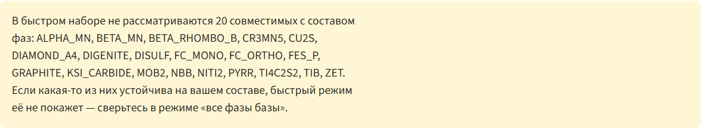
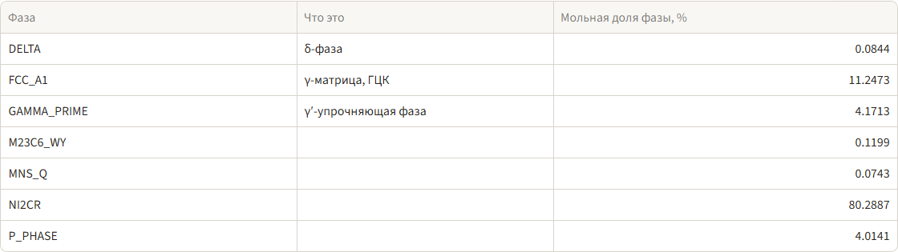

# ХН62М(Sc)-ВИ (ЭК199-ВИ) — расчётное исследование фазовых равновесий

Разбор для материаловеда. Все числа получены расчётом на базе `mc_ni` 2.036 движком проекта
(`app/thermogar_parallel.py`, `app/thermogar_equilibrium_core.py`, `app/thermogar_physical.py`,
`app/thermogar_diffusion.py`) скриптом `tools/study_hn62m.py`. Первичные таблицы — в
`results/hn62m/` и в сводной книге `results/hn62m/ХН62М_расчёт.xlsx`; ссылки на листы даны в
каждом разделе.

Это термодинамический расчёт, а не результат испытаний. Экспериментальной проверки на этом
сплаве не проводилось; см. раздел «Чего расчёт не покрывает» и отдельный документ
[«Границы применимости расчёта»](LIMITS_OF_APPLICABILITY.md).

> **Состояние документа.** Текст написан по волне 9. Волна 10 исправила три дефекта движка,
> которые затрагивают числа этого исследования: дублирование параметров подвижности (отсюда
> неверный коэффициент диффузии и неверные времена гомогенизации), потерю вакансии в
> межузельной подрешётке при расчёте плотности (отсюда занижение плотности в 1,7 раза) и
> неполный быстрый набор фаз для никеля. Разделы 2, 4, 5, 8 и 9 правки не затрагивают: там
> считалось на полном наборе фаз и без участия подвижностей и плотности.
>
> **Числа пересчитаны потоками 11A/11D/11J и подставлены сюда волной 11M-3.** Источники —
> `tasks/WAVE11A_REPORT.md` и `tasks/WAVE11L_REPORT.md`. Временных меток в тексте больше нет.
> Отдельно отмечено, где число осталось **оценкой снизу** (полный интервал кристаллизации по
> Шейлю, раздел 10.1: там же он заменён устойчивым интервалом хрупкости) и где вывод волны 10
> **снят**, а не уточнён (марганец, раздел 10.3).
>
> Наклон ρ(T) исправлен волной 11M-2 перекрывающим слоем к физической базе — раздел 6 и
> `docs/DATABASES.md`, раздел 8.

---

## 1. Что считали

**Состав, масс. %** (середина марки, основа никель):

| C | Si | Mn | S | Cr | Mo | Nb | Al | Ti | Fe | Ni |
|---|---|---|---|---|---|---|---|---|---|---|
| 0,005 | 0,10 | 0,50 | 0,020 | 23,5 | 13,0 | 0,06 | 0,25 | 0,10 | 0,50 | 61,965 |

Пересчёт в мольные доли — функцией приложения `mass_to_mole_fractions`; получается
x(Ni) = 0,6292, x(Cr) = 0,2694, x(Mo) = 0,0808. Полный список — лист **Состав и настройки**.

**Чего в расчёте нет и почему:**

* **Sc 0,05 %** — скандия нет в базе `mc_ni` (он есть только в `mc_al`). Считался базовый сплав
  без скандия. При ~0,06 ат. % влияние на матричные равновесия лежит в пределах погрешности
  описания, но это относится только к равновесию матрицы. **Структурная и оксидная роль скандия
  не моделируется вообще**: ни модифицирование границ зёрен, ни оксиды Sc₂O₃, ни влияние на
  окалиностойкость и на размер зерна в расчёте не участвуют. Всё, что в марке ожидается от Sc,
  этим расчётом не подтверждается и не опровергается.
* **P 0,025 %** — фосфора в `mc_ni` нет. Это примесь; на положение фазовых границ при таком
  уровне она не влияет, но зернограничная сегрегация фосфора расчётом не описана.
* **Y** в марке отсутствует, в расчёт не входил.

И скандий, и фосфор действуют прежде всего по зернограничному механизму, то есть попадают
сразу под два ограничения: элемента нет в базе, и сам механизм для CALPHAD недоступен. Разбор —
[«Границы применимости расчёта»](LIMITS_OF_APPLICABILITY.md).

**Параметры расчёта.** Компоненты: NI, CR, MO, C, SI, MN, S, NB, AL, TI, FE, VA — одиннадцать
элементов и вакансии. Плотность стартовой выборки `pdens = 100` — штатное значение проекта
(`app/ThermoGar_app.py:3281`, весь `tools/backend_reference.md`). Отдельные точки, не сошедшиеся
при этом значении, пересчитаны с `pdens` 200/300/50 и перечислены на листе
**Точки не штатного pdens**.

**Фаз в расчёте — 48.** Из совместимого набора базы принудительно исключена одна фаза:

> **BCC_B2 не строится.** При наличии углерода pycalphad отказывается инстанцировать связанную
> модель BCC_B2/BCC_A2: `ValueError: Order (BCC_B2) and disorder (BCC_A2) model must have no
> interstitial sublattice or a single matching one`. Это не особенность сплава, а свойство пары
> «упорядоченная/разупорядоченная ОЦК + внедрённый углерод» в `mc_ni`. В приложении тот же
> состав в режиме «все фазы базы» упадёт с этой же ошибкой, поэтому фаза исключена из всех
> наборов явно. На результат это не влияет: ОЦК-фаза в никелевой матрице с 23,5 % Cr при
> рассмотренных температурах не устойчива.

Фазы `M12C`, заявленной в задании, среди совместимых с этим набором компонентов нет — она
отфильтрована `filter_phases` и в расчёте не участвует. Карбидная линия представлена
`M6C`, `M23C6`, `M23C6_WY`, `M7C3`, `M3C2`, `CEMENTITE`, `KSI_CARBIDE`.

---

## 2. Фазовый состав по температуре, 400–1450 °C

Листы **П1 скан T все фазы**, **П1 сольвусы все фазы**, **П1 составы фаз**; графики
`results/hn62m/p1_scan_all.png`, `p1_scan.png`.

Физическая картина берётся из расчёта на полном наборе 48 фаз. Расчёт на «быстром наборе»
(25 фаз) вынесен в раздел 9 как контроль пресета — он на этом сплаве теряет фазы.

### Границы устойчивости

| Фаза | Есть с, °C | Верхняя граница (сольвус), °C | Макс. мольная доля | При, °C |
|---|---|---|---|---|
| LIQUID | 1350 | выше 1450 (край сетки) | 1,000 | — |
| FCC_A1 (матрица γ) | 400 | 1380 | 0,9993 | 1340 |
| MNS_Q (сульфид Mn) | 400 | 1350 | 0,00074 | 950 |
| TIS | 1340 | 1350 | 0,00014 | 1340 |
| M6C | 800 | 1070 | 0,00156 | 800 |
| **P_PHASE (TCP)** | 400 | **960** | 0,298 | 540 |
| M23C6 | 440 | 800 | 0,0012 | 440 |
| GAMMA_PRIME (γ′) | 400 | 700 | 0,042 | 400 |
| **NI2CR** | 400 | **540** | **0,803** | 400 |
| M23C6_WY | 400 | 440 | 0,0012 | 400 |
| DELTA | 400 | 440 | 0,00084 | 400 |

Фазы `SIGMA`, `MU_PHASE`, `CHI_A12`, `LAVES`, `LAV_C14`, `R_PHASE`, `D_NIMO` в равновесии
номинального состава **не появляются ни при одной температуре 400–1450 °C**. Единственная
устойчивая TCP-фаза — **P-фаза**.

### Как это читается

**Сплав нигде не бывает однофазным.** Сульфид марганца `MNS_Q` устойчив от 400 до 1350 °C, то
есть при любой температуре ниже солидуса, с постоянной мольной долей 0,00074 (около 0,07 %).
Слово «однофазный» к этому сплаву неприменимо ни при какой температуре, и дальше по документу
оно не используется как технологический признак.

Рабочий признак — **отсутствие ТПУ-фаз** (топологически плотноупакованных; в таблицах и на
графиках этого документа они обозначены латинским `TCP`, для этого сплава это P-фаза). По нему
температурная ось делится на три полосы, и дальше весь документ пользуется именно ими:

| Полоса | Что в равновесии | ТПУ |
|---|---|---|
| **выше 1070 °C** | γ и сульфид марганца (около 0,07 %) | нет |
| **960–1070 °C** | то же плюс карбид M6C, не более 0,16 % | нет |
| **ниже 960 °C** | появляется P-фаза, и её быстро становится много | **есть** |

Граница 960 °C — сольвус P-фазы для середины марки. По полю марочного допуска она смещается
вверх, до **975 °C** (раздел 4), и это та граница, от которой следует отсчитывать технологу.

Следовой карбид M6C в средней полосе на технологию не влияет: 0,16 % мольной доли — это
количество, которое не меняет ни поведение при нагреве, ни свойства. Поэтому обе верхние полосы
одинаково годятся под закалку, отжиг и пайку, а решает только нижняя граница.

**Ниже 960 °C выделяется P-фаза**, и выделяется её много. Доли по мольной доле:

| T, °C | 950 | 900 | 850 | 800 | 700 | 600 | 540 |
|---|---|---|---|---|---|---|---|
| P_PHASE | 0,008 | 0,064 | 0,112 | 0,153 | 0,223 | 0,274 | 0,298 |

При 700 °C равновесие содержит **22 % P-фазы по мольной доле** (24 % по массе). Это состояние
полного равновесия, а не то, что образуется за разумное время выдержки, но направление
однозначное: длительная работа в интервале 600–900 °C ведёт к массивному выделению TCP.

**Ниже 540 °C появляется NI2CR** — упорядоченная фаза Ni₂Cr, известная для сплавов системы
Ni–Cr–Mo. При 400 °C её мольная доля 0,80. Упорядочение Ni₂Cr — практическая проблема этого
класса сплавов (охрупчивание при 300–500 °C за тысячи часов), и расчёт её воспроизводит.

**γ′ существует ниже 700 °C**, но в мизерных количествах (0,04 при 400 °C и меньше выше) —
алюминия и титана в марке для упрочняющей γ′ недостаточно. Это твердорастворный сплав, а не
дисперсионно-твердеющий.

### Состав фаз: чем обедняется матрица

Лист **П1 составы фаз**, для восьми температур — лист **П2 точки** и **П2 распределение**.

Матрица (FCC_A1), масс. %:

| T, °C | 400 | 500 | 600 | 700 | 800 | 900 | 950 | ≥ 1000 |
|---|---|---|---|---|---|---|---|---|
| Cr | 14,8 | 18,8 | 21,1 | 21,4 | 22,2 | 23,0 | 23,5 | 23,5 |
| Mo | 1,8 | 3,5 | 5,1 | 7,0 | 9,2 | 11,5 | 12,8 | 13,0 |
| Ni | 74,4 | 74,1 | 71,9 | 69,6 | 66,8 | 63,8 | 62,3 | 62,0 |

P-фаза стабильна по составу и практически не зависит от температуры:
**~30 % Cr, ~32 % Mo, ~38 % Ni по массе**. То есть это молибденовая фаза: она вытягивает из
матрицы прежде всего Mo.

Доля общего количества элемента, ушедшая в P-фазу (лист **П2 распределение**):

| T, °C | 600 | 700 | 800 | 900 | ≥ 1000 |
|---|---|---|---|---|---|
| Mo в P-фазе, % | 72,6 | 59,2 | 40,7 | 16,9 | 0 |
| Cr в P-фазе, % | 37,3 | 30,6 | 21,1 | 8,8 | 0 |

**Это главный практический вывод по коррозионной стойкости.** При 600 °C почти три четверти
молибдена сплава сидит в P-фазе, а матрица содержит 5,1 % Mo вместо 13,0 %. Питтингостойкость
и стойкость в восстановительных средах определяются молибденом **матрицы**, а не средним
составом сплава. Обеднение матрицы по Mo в 2,5 раза при 600 °C и в 1,4 раза при 800 °C — то,
что должно определять допустимую длительную рабочую температуру.

Углерод при 600–900 °C почти целиком связан в карбиде (M23C6 ниже 800 °C, M6C выше):
99,5 % C при 600 °C, 90 % при 800 °C, 75 % при 900 °C. Карбид M6C по составу — молибденовый
(48 % Mo, 19 % Cr, 30 % Ni, 2,8 % C по массе), но из-за ничтожного содержания углерода
(0,005 %) его доля не превышает 0,16 %, и на баланс молибдена он не влияет.

Ниобий и титан при 700 °C и выше целиком растворены в матрице. Сера полностью связана в
`MNS_Q` во всём интервале — сульфид MnS присутствует как отдельная фаза с постоянной мольной
долей 0,00074 вплоть до 1350 °C.

---

## 3. Затвердевание

Листы **П3 равновесное**, **П3 Шейль**, **П3 итоги**; график `results/hn62m/p3_solidification.png`.

### Равновесное

| Величина | Значение |
|---|---|
| Ликвидус | **1375,0 °C** |
| Солидус | **1344,5 °C** |
| Интервал кристаллизации | **30,5 K** |

Метод — половинное деление, точность 0,1 K (пункт A1 потока 11A). Значения **нечувствительны к
плотности выборки**: от `pdens` 50 до 500 они не меняются ни на 0,01 K.

Числа волны 9 (1378,2 / 1340,1 °C, интервал 38 K) **неверны**: они получены линейной
интерполяцией по сетке 5 K через резкий переход, и воспроизведение того метода дало ровно их.
Пересчёту не подлежат.

Последовательность при равновесном охлаждении не зависит от точности температур:
L → L + γ → γ, плюс сульфиды TIS и MnS в самом конце затвердевания.

### По Шейлю (волна 9: шаг 5 K, старт 1750 K)

> **Неравновесный солидус 1284 °C и интервал 94 K из волны 9 недействительны.** Расчёт
> стартовал на 98 K выше ликвидуса и шёл шагом 5 K. Направление ликвации волна 9 показывала
> верно, абсолютные температуры — нет. Итог по технологичности см. в разделе 10.
>
> **Главная величина — интервал хрупкости, а не полный интервал кристаллизации** (поток 11R):
>
> ```
> T(доля твёрдого 0,90) = 1328,2 °C
> T(доля твёрдого 0,99) = 1263,6 °C
> интервал хрупкости   ≈ 64,6 K
> ```
>
> Именно этой стадией — пока жидкость ещё связна и образует плёнки по границам — определяются
> горячие трещины. Числа в этом окне устойчивы: температуры при долях твёрдого 0,50 / 0,90 /
> 0,95 совпадают у трёх прогонов с разной плотностью выборки с точностью **0,03 K**.
>
> **Полный интервал по Шейлю этим методом не определяется** и остаётся справочной оценкой
> снизу: **не менее 112,9 K** (1375,0 → 1262,1 °C, поток 11P, шаг 0,5 K, старт от ликвидуса,
> `pdens` 500). Расчёт останавливается на доле твёрдого 0,9905, последние **0,95 %** жидкости
> не разрешены; причина останова — **отказ сходимости солвера** (`Found set()`), а не
> инвариантное равновесие и не конец затвердевания. Точка останова сдвигается с плотностью
> выборки всё сильнее, то есть ряд не сходится. Прежние 79,0 K (`pdens` 100) и 83,0 K
> (`pdens` 300) были занижены дважды: и обрывом расчёта, и сеткой. История всех четырёх чисел и
> оговорки к границам 0,90 / 0,99 — раздел 10.1.

> **К обеим таблицам ниже относится та же оговорка:** они получены прогоном с шагом 5 K и
> стартом на 98 K выше ликвидуса и подлежат уточнению в волне 11A. Порядок элементов и
> направление ликвации верны, абсолютные величины — нет.

Последовательность фаз затвердевания и накопленные доли:

| Фаза | Накоплено к концу |
|---|---|
| FCC_A1 | 0,9817 |
| SIGMA | 0,00104 |
| MNS_Q | 0,00033 |
| TIS | 0,00022 |
| TI4C2S2 | 0,000065 |
| M6C | следы |

**Терминальная фаза — σ**, а не P-фаза. Это важное расхождение с равновесной картиной: в
равновесии σ не устойчива ни при одной температуре, но при неравновесном затвердевании
последняя жидкость обогащается настолько, что σ выделяется в междендритных участках.

Обогащение последней жидкости (мольные доли, от начала к концу). **Числа из прогона волны 9 с
шагом 5 K и неверным стартом; уточняются в волне 11A** — цитировать их как результат нельзя:

| Элемент | Начало | Конец | Кратность |
|---|---|---|---|
| C | 0,000248 | 0,00993 | **40,0** |
| Nb | 0,000385 | 0,00605 | **15,7** |
| Si | 0,00212 | 0,00908 | 4,3 |
| Ti | 0,00125 | 0,00282 | 2,3 |
| **Mo** | 0,0808 | **0,1368** | **1,69** |
| **Cr** | 0,2694 | **0,3288** | **1,22** |

Сегрегация в твёрдой фазе (FCC_A1), мольные доли: Mo от 0,0699 в оси дендрита до 0,1146 в
междендритном участке (то есть **11,3 → 18,3 масс. %**), Cr от 0,2569 до 0,3084
(**22,4 → 26,2 масс. %**). Этот профиль и взят исходным для расчёта гомогенизации в разделе 7.

Расчёт Шейля дошёл до доли твёрдого 1,0 за 45 шагов; флаг `converged` при этом `false` — это
означает, что расчёт закончился исчерпанием жидкости, а не срабатыванием критерия остановки, и
ошибкой не является.

Кроме того, более точный расчёт волны 10 показал, что доля твёрдого доводится не до 1,0, а до
0,967: последние 3,3 % жидкости численно не разрешаются — см. раздел 10.1.

**Почему полный интервал заменён интервалом хрупкости.** Ряд 94 → 79,0 → 83,0 → 112,9 K оборван
не потому, что сошёлся, а потому, что расходится: точка обрыва пути сдвигается с плотностью
выборки всё быстрее (от `pdens` 100 к 300 доля твёрдого на обрыве сдвинулась на 0,0034, от 300 к
500 — на 0,0199, в шесть раз больше). Предел, который виден в расчёте, принадлежит плотности
выборки, а не физике сплава. Второй заход волны 11Q — взять состав жидкости в последней
посчитанной точке каждого прогона самостоятельным сплавом и найти его равновесный солидус — дал
три разъехавшихся значения (1255,3 / 1250,5 / 1198,6 °C, разброс 56,7 K): три остаточные
жидкости оказались разным веществом, потому что взяты в разных точках пути ликвации.

**Метод при этом исправен.** Волна 11R повторила ту же выкладку на **одной и той же доле
твёрдого 0,95**, где посчитаны все три прогона, — тогда сравниваются три оценки одной величины,
а не три разных вещества:

| `pdens` пути | T пути при доле твёрдого 0,95, °C | Равновесный солидус остаточной жидкости, °C | Устойчивые фазы ниже него |
|---|---|---|---|
| 100 | 1310,44 | **1264,78** | γ, σ, M6C, TI4C2S2, MNS_Q |
| 300 | 1310,47 | **1264,69** | γ, σ, M6C, TI4C2S2, MNS_Q |
| 500 | 1310,44 | **1264,78** | γ, σ, M6C, TI4C2S2, MNS_Q |

Разброс **0,09 K**, набор фаз один и тот же. Значит разъезд в 56,7 K объясняется именно разными
точками пути, а не неустойчивостью метода. Это проверка согласованности, а не ответ на вопрос о
конце затвердевания: на доле твёрдого 0,95 затвердевание ещё не кончилось. Расчёт —
`results/hn62m_tech/q1_summary.json`, `q1_residual_solidus.csv`, `r1_summary.json`,
`r1_same_fraction_solidus.csv`, `r1_fraction_check.csv`; история числа и оговорки — раздел 10.1.

---

## 4. Изоплеты: где проходит граница TCP

Листы **П4 изоплета Cr**, **П4 изоплета Mo**, **П4 граница Cr**, **П4 граница Mo**; графики
`results/hn62m/p4_isopleth_cr.png`, `p4_isopleth_mo.png`.

Сечения при неизменном остальном составе: Cr 20–26 масс. % (шаг 0,5) и Mo 10–16 масс. %
(шаг 0,5), T 500–1500 °C (шаг 25 K), по 533 точки на сечение. Считалось на полном наборе фаз.

### Сечение по хрому (Mo 13,0 %)

Верхняя граница области TCP (сольвус P-фазы):

| Cr, масс. % | 20,0 | 21,0 | 22,0 | 23,0 | **23,5** | 24,0 | 25,0 | 26,0 |
|---|---|---|---|---|---|---|---|---|
| Граница TCP, °C | 850 | 875 | 900 | 925 | **950** | 950 | 975 | 1000 |
| Макс. Σ TCP | 0,236 | 0,260 | 0,280 | 0,287 | **0,294** | 0,301 | 0,313 | 0,322 |

Наклон границы — примерно **+25 K на каждый 1 % Cr**. От нижнего края марки (23,0 %) до
верхнего (24,0 %) граница смещается на 25 K — с 925 до 950 °C.

Σ TCP (мольная доля) в поле сечения:

| T, °C \ Cr, % | 20,0 | 21,0 | 22,0 | 23,0 | 24,0 | 25,0 | 26,0 |
|---|---|---|---|---|---|---|---|
| 600 | 0,197 | 0,222 | 0,246 | 0,265 | 0,281 | 0,295 | 0,306 |
| 700 | 0,133 | 0,162 | 0,188 | 0,213 | 0,233 | 0,250 | 0,265 |
| 800 | 0,051 | 0,083 | 0,113 | 0,141 | 0,166 | 0,188 | 0,208 |
| 850 | 0,001 | 0,036 | 0,068 | 0,098 | 0,125 | 0,150 | 0,172 |
| 900 | 0 | 0 | 0,016 | 0,049 | 0,078 | 0,105 | 0,130 |
| 950 | 0 | 0 | 0 | 0 | 0,024 | 0,054 | 0,080 |
| 1000 | 0 | 0 | 0 | 0 | 0 | 0 | 0,023 |

Максимум количества P-фазы приходится на 525–550 °C, ниже он падает за счёт конкуренции с
NI2CR.

### Сечение по молибдену (Cr 23,5 %)

| Mo, масс. % | 10,0 | 11,0 | 12,0 | **13,0** | 14,0 | 15,0 | 16,0 |
|---|---|---|---|---|---|---|---|
| Граница TCP, °C | 850 | 875 | 900 | **950** | 975 | 1000 | 1025 |
| Макс. Σ TCP | 0,202 | 0,232 | 0,263 | **0,294** | 0,326 | 0,366 | 0,397 |

Наклон границы — примерно **+30 K на каждый 1 % Mo**.

Σ TCP (мольная доля) в поле сечения:

| T, °C \ Mo, % | 10,0 | 11,0 | 12,0 | 13,0 | 14,0 | 15,0 | 16,0 |
|---|---|---|---|---|---|---|---|
| 600 | 0,179 | 0,210 | 0,242 | 0,274 | 0,305 | 0,337 | 0,369 |
| 700 | 0,124 | 0,157 | 0,190 | 0,223 | 0,256 | 0,289 | 0,322 |
| 800 | 0,050 | 0,085 | 0,120 | 0,153 | 0,188 | 0,223 | 0,259 |
| 900 | 0 | 0 | 0,027 | 0,064 | 0,101 | 0,139 | 0,176 |
| 950 | 0 | 0 | 0 | 0,008 | 0,047 | 0,086 | 0,125 |
| 1000 | 0 | 0 | 0 | 0 | 0 | 0,024 | 0,065 |
| 1050 | 0 | 0 | 0 | 0 | 0 | 0 | 0 |

### Что дают оба сечения вместе

* **Молибден влияет сильнее хрома**: +30 K на 1 % Mo против +25 K на 1 % Cr, а по количеству
  TCP разница ещё заметнее — при 800 °C переход 13 → 16 % Mo поднимает Σ TCP с 0,153 до 0,259,
  тогда как переход 23,5 → 26 % Cr — с 0,153 до 0,208.
* **Граница TCP для номинального состава — 950 °C** по обоим сечениям, что сходится с
  сольвусом P-фазы 960 °C из раздела 2 (разница — шаг сетки 25 K).
* **Обе оси упираются в одно ограничение:** чтобы поднять верхнюю границу области без ТПУ
  выше 1000 °C, нужно уйти за верхний край марки и по хрому (> 25,5 %), и по молибдену
  (> 14,5 %). Внутри поля допуска граница лежит в пределах 925–975 °C.
* Максимум количества P-фазы во всех сечениях приходится на 525–550 °C.
* Ни в одной точке обоих сечений (1066 точек, 500–1500 °C) не появляются σ, μ, χ, Лавес,
  R-фаза и D_NIMO — вся область TCP на этом сплаве представлена **только P-фазой**.

---

## 5. Насколько сплав «близок» к TCP

Лист **П5 движущие силы**; график `results/hn62m/p5_driving_forces.png`.

Движущая сила выделения считалась относительно пересыщенной матрицы: сначала решалось
равновесие из одной фазы FCC_A1 при составе сплава, из него брались химические потенциалы
μᵢ, затем по составному пространству каждой фазы искался максимум Σμᵢxᵢ − G. Положительная
величина означает, что фаза может выделиться из такой матрицы.

Движущая сила, Дж/моль атомов:

| Фаза | 700 °C | 800 °C | 900 °C | Устойчива в равновесии |
|---|---|---|---|---|
| **P_PHASE** | **+1603** | **+977** | **+351** | да |
| M23C6 | +5600 | +3661 | +1784 | да при 700, нет при 800–900 |
| M6C | +4356 | +3049 | +1742 | да при 800–900 |
| **SIGMA** | **+315** | −367 | −1040 | нет |
| MU_PHASE | −1898 | −2737 | −3399 | нет |
| LAVES | −5512 | −6530 | −7538 | нет |
| CHI_A12 | −12 487 | −14 138 | −15 787 | нет |

Читается так:

* **P-фаза — главный и единственный устойчивый TCP-риск.** Движущая сила падает от 1603 Дж/моль
  при 700 °C до 351 Дж/моль при 900 °C и обращается в ноль на сольвусе 960 °C.
* **σ-фаза находится на грани.** При 700 °C движущая сила +315 Дж/моль — величина того же
  порядка, что погрешность описания. То есть по расчёту σ при 700 °C уже может выделяться
  метастабильно, хотя в равновесии её нет. Это согласуется с тем, что σ оказалась терминальной
  фазой при затвердевании по Шейлю (раздел 3): в междендритных участках, обогащённых Mo и Cr,
  она выделяется реально.
* μ-фаза, Лавес и χ отделены от матрицы 2–16 кДж/моль и на этом сплаве нереализуемы.
* Составы фаз в точке максимума движущей силы: P-фаза ~40 % Cr и 20 % Mo (ат.), σ ~40 % Cr и
  30–40 % Mo. Оба — заметно богаче матрицы и по хрому, и по молибдену.

Столбец «ΔG при составе сплава» в таблице пуст для всех TCP-фаз. Это не сбой: составные модели
этих фаз не допускают состав, равный составу сплава (в P и σ никель не может занимать позиции
в тех долях, что в γ), поэтому «параллельная касательная при одинаковом составе» для них
не существует. Сравнение возможно только через химические потенциалы, что и сделано.

---

## 6. Плотность

Лист **П6 плотность**; график `results/hn62m/p6_density.png`.

Расчёт по `physical_data_v103.pdb` в интервале 25–1200 °C с шагом 25 K.

> **Числа волны 9 в этом разделе недействительны и заменены.** Волна 10 нашла и
> исправила корень занижения в 1,7 раза: `_site_fractions_from_equilibrium` строил модель без
> вакансии, межузельная подрешётка `(C,VA)` после нормировки по неполному набору вырождалась в
> чистый углерод, и вместо матрицы считалась плотность **карбидного конечного члена**. Заодно
> смешение переведено с линейного по мольной доле на объёмную аддитивность по массе
> (`1/ρ = Σ wᵢ/ρᵢ`), а для фаз без модели в PDB добавлена помеченная оценка по правилу смеси.
> После этих правок плотность сплава считается при всех температурах.

**Плотность при 25 °C — 8,481 г/см³** (пункт A2 потока 11A). Значение сверено независимо, по
объёмной аддитивности: 8,479 г/см³.

**Граница достоверности по составу фаз — 950 °C.** Доля фаз, у которых прямой модели плотности
в PDB нет и которые считаются оценкой по правилу смеси, падает ниже 1 % только **начиная с
950 °C**. Выше 950 °C число опирается на прямые модели и достоверно; ниже — это прикидка:
при 25 °C на фазы без модели приходится 82 % молей, главным образом из-за Ni₂Cr, чья доля
доходит до 86 % при 350 °C.

| T, °C | ρ сплава, г/см³ |
|---|---|
| 25 | **8,481** (прикидка по составу фаз, см. выше) |
| 900 | 8,07 |
| 1300 | 7,79 |

**Наклон ρ(T) восстановлен волной 11M-2.** До неё высокотемпературные значения были
непригодны: тепловое расширение хрома в `physical_data_v103.pdb` завышено в 2,5–3 раза, и
средний коэффициент расширения матрицы выходил 21,2·10⁻⁶/K вместо физичных 12…20. Перекрывающий
слой проекта восстанавливает коэффициенты из статьи REF 14 самой базы (Lu X.-G., Selleby M.,
Sundman B., Calphad **29** (2005) 68–89, `doi:10.1016/j.calphad.2005.05.001`), сверенные с
измерением Hidnert P., J. Research NBS **27** (1941) 113–124, RP1407. Это **восстановление
источника, а не наша оценка величины**: сломан был перенос чисел в базу. Подробности —
`docs/DATABASES.md`, раздел 8.

Опорная точка 25 °C правкой не затронута: правился только наклон, 8,481 г/см³ осталось прежним.

Ниже оставлено то, что от разбора волны 9 сохраняет силу, — покрытие PDB по фазам:

| Фаза | Модель плотности в PDB v1.03 |
|---|---|
| FCC_A1 | есть (от 298,15 K) |
| M6C, M23C6, GAMMA_PRIME | есть |
| **NI2CR** | **нет** |
| **P_PHASE** | **нет** |
| **MNS_Q** | **нет** |
| **DELTA** | **нет** |
| **MU_PHASE** | **нет** |

Прямой модели в PDB нет у пяти фаз, и сульфид MnS присутствует во всём интервале, а P-фаза —
ниже 960 °C. В волне 9 это означало, что `alloy_density_kg_m3` остаётся пустым везде. После
волны 10 такие фазы получают **оценку по правилу смеси** из плотностей элементов той же PDB и
помечаются в выдаче как оценочные, поэтому плотность сплава выводится при всех температурах, но
со своей оговоркой: при низких температурах оценочной оказывается большая часть мольной доли
фаз (главным образом из-за Ni₂Cr), и число там следует считать ориентировочным. Правильное
решение остаётся прежним — **дополнить PDB моделью для Ni₂Cr** и для остальных четырёх фаз.

Нижняя точка интервала сдвинута с 20 на 25 °C: параметры плотности PDB объявлены от 298,15 K,
и при 293,15 K `thermogar_physical` отказывается считать
(`Температура 293.15 K вне диапазона DP-параметра FCC_A1`).

### Плотность матрицы

Прежняя таблица ρ(FCC_A1) = 4888…5462 кг/м³ была следствием дефекта, описанного выше, и
удалена. Матрица FCC_A1 контрольного состава при 25 °C — **8,48 г/см³**; выше 950 °C, где на
фазы без модели приходится менее 1 % молей, плотность сплава и плотность матрицы практически
совпадают, и таблица выше относится к обеим. **Подставлять вместо расчёта справочную величину
не следует** — почему, сказано ниже.

Отдельно предупреждение против одной такой подстановки. Часто встречающееся «≈ 8,9 г/см³ для
сплавов этого класса» к ХН62М **не относится**: 8,9 — это чистый никель и хастеллои типа C-276
с 16 % Mo. В ХН62М молибдена 13 %, а хрома 23,5 %, и хром здесь самый лёгкий компонент, поэтому
сплав заметно легче. Ошибка такой подстановки — порядка 5 %, то есть больше, чем разброс,
который обычно считают приемлемым для плотности. Правило смесей **по элементам** ошибается в ту
же сторону и по той же причине: аддитивен объём, а не плотность.

---

## 7. Гомогенизация по молибдену

Листы **П7 гомогенизация**, **П7 сверка D**, **П7 прогоны**, **П7 штатный модуль**; график
`results/hn62m/p7_homogenization.png`.

> **Времена гомогенизации из волны 9 недействительны и заменены.** Они получены на
> неверных коэффициентах диффузии: в конвертированной базе параметр подвижности задавался
> дважды — общей строкой-умолчанием и явной строкой с тем же выражением, — pycalphad складывал
> оба вклада, и вместо `exp(MQ/RT)` получалось `exp(2·MQ/RT)`, то есть квадрат коэффициента
> диффузии. Дефект исправлен в волне 10.

### Коэффициент диффузии молибдена

| T, °C | D(Mo) при составе сплава, м²/с | D(Mo) в разбавленном пределе, м²/с |
|---|---|---|
| 1150 | **1,149·10⁻¹⁴** | 1,063·10⁻¹⁴ |
| 1175 | **1,694·10⁻¹⁴** | 1,570·10⁻¹⁴ |
| 1200 | **2,467·10⁻¹⁴** | 2,278·10⁻¹⁴ |

Отношение «при составе сплава к разбавленному пределу» — **1,08**. Прежний двухпорядковый
разрыв волны 9 (87–97 раз) был дефектом умолчаний подвижности, а не физикой. Число волны 9
при 1150 °C — 1,033·10⁻¹² — завышено в 90 раз.

### Времена выдержки до остаточной амплитуды 5 % по молибдену

**Размер ячейки указывать обязательно.** Время идёт как квадрат полуволны L, поэтому одна и та
же температура даёт разброс в сто раз между печатью и литьём. Формулировка «окно гомогенизации
1175–1200 °C» без размера ячейки технолога вводит в заблуждение.

Ниже — **численный счёт** (решатель `kawin`, 40 узлов, профиль сегрегации по Шейлю). В скобках
— аналитическая оценка `t = 3,24·L²/π²D`.

| Полуволна L | Какому состоянию отвечает | 1150 °C | 1175 °C | 1200 °C |
|---|---|---|---|---|
| 0,5 мкм | лазерная печать, ячеистая структура | **6 с** (7 с) | **4 с** (5 с) | **3 с** (3 с) |
| 1 мкм | лазерная печать, ячеистая структура | **23 с** (29 с) | **16 с** (19 с) | **11 с** (13 с) |
| 5 мкм | мелкая дендритная структура, быстрая кристаллизация | **0,16 ч** (0,20 ч) | **395 с** (484 с) | **273 с** (332 с) |
| 25 мкм | литая заготовка, вторичные оси дендритов | **4,01 ч** (4,96 ч) | **2,74 ч** (3,36 ч) | **1,89 ч** (2,31 ч) |
| 50 мкм | литая заготовка, вторичные оси дендритов | **16,05 ч** (19,83 ч) | **10,96 ч** (13,44 ч) | **7,58 ч** (9,23 ч) |
| 100 мкм | литая заготовка, вторичные оси дендритов | **2,67 сут** (3,30 сут) | **1,83 сут** (2,24 сут) | **30,32 ч** (36,94 ч) |

**Почему в документ идёт численное значение, а аналитика — в скобках.** Численный счёт
систематически быстрее аналитики на **19 %** (отношение 0,809…0,821 на всех температурах и
размерах). Расхождение не случайное: аналитическая формула выводится для синусоидального
профиля, а реальный профиль сегрегации по Шейлю синусоидой не является. Поэтому **аналитику
следует читать как консервативную оценку сверху**, а не как альтернативный результат.

### Рекомендуемое окно гомогенизации

**1175–1200 °C, и обязательно с указанием размера ячейки.** Потолок задан не диффузией, а
локальным солидусом междендритного участка: в литом негомогенизированном состоянии нагревать
не выше **1272 °C** (раздел 10.2), то есть 1200 °C укладывается с запасом.

Практические выдержки на литой заготовке (полуволна 25–50 мкм): **при 1200 °C от 1,9 до 7,6
часа**, при 1150 °C — от 4,0 до 16,1 часа. Для аддитивной печати (полуволна 0,5–1 мкм) речь
идёт о **секундах**, и отдельная гомогенизирующая выдержка там смысла не имеет.

**Оговорка, снимающая половину практической ценности этих чисел.** Выравнивание молибдена
внутри ячейки — не единственный и, скорее всего, не определяющий фактор длительности
гомогенизации: реальное время задаётся растворением междендритных выделений (σ, карбиды,
сульфиды) и фактическим масштабом дендритной ячейки в конкретной отливке. Ни того, ни другого
этот расчёт не даёт.

### Что было не так и как исправлено

Строки вида

```
PARAMETER MQ(FCC_A1&NI,*)    273.00  -287000-69.8*T;  6000.00  N
PARAMETER MQ(FCC_A1&NI,NI:*) 273.00  -287000-69.8*T;  6000.00  N
```

(то же для MO и CR) суммировались. Волна 9 обошла это постоянным множителем `1/D` при среднем
составе профиля и отдельно отметила «вилку в два порядка» между D(Mo) в разбавленном пределе и
D(Mo) при составе сплава, приписав её параметрам взаимодействия.

**Волна 10 показала, что вилки не существует.** Простое удаление вырожденной строки чинило
только разбавленный предел и ломало концентрированный: в `mc_ni` та же строка была
единственным источником подвижности молибдена в хроме. Правильное решение — **материализация
умолчания**: для каждого составляющего первой подрешётки, у которого своей строки нет,
вставляется копия умолчания с явным массивом составляющих, и лишь затем вырожденная строка
убирается. Это та семантика, которую строке приписывает Thermo-Calc. После правки отношение
«D при составе сплава к D в разбавленном пределе» равно **1,07** вместо прежних 87–97, то есть
двухпорядковый разрыв был тем же дефектом умолчаний, а не физикой. Ключ кэша разобранной базы
получил версию логики правок, иначе пользователь со старым кэшем остался бы со старым
поведением.

Штатный кинетический раздел, который на прежней базе **не выравнивал профиль вовсе**
(остаточная амплитуда по Mo 1,000 за час модельного времени при 1150 °C), после правки
работает; это закреплено тестом `test_run_diffusion_changes_composition`. Подробности —
`tasks/WAVE10_REPORT.md`, пункт A3.

### Постановка (в силе)

Начальный профиль — прямоугольная ступень из результата Шейля: ось дендрита
Cr 22,42 / Mo 11,26 масс. %, междендритный участок Cr 26,21 / Mo 18,26 масс. %. Отрезок длиной
L с непроницаемыми границами, 40 узлов, фаза FCC_A1. Такой отрезок эквивалентен периодической
сегрегации с длиной волны 2L, поэтому «масштаб ячейки» в таблицах — это L. Критерий — падение
размаха по Mo до 5 % от исходного.

Для прямоугольного профиля первая гармоника имеет амплитуду 4/π от амплитуды ступени, размах
падает как (4/π)·exp(−π²Dt/L²), и аналитическая оценка времени до остатка 5 % —
t = (L²/π²D)·ln((4/π)/0,05) = 3,24·L²/π²D. Сама постановка от дефекта базы не зависит и
остаётся основой. Начальный профиль волны 9 был взят из расчёта Шейля с шагом 5 K и неверным
стартом; **действующий профиль** снят с уточнённого расчёта Шейля (шаг 0,5 K, старт от
ликвидуса) и выражен в мольных долях:

| Участок | x(Cr) | x(Mo) |
|---|---|---|
| Ось дендрита | 0,2569 | 0,0699 |
| Междендритный участок | 0,3073 | 0,1194 |

Размах по молибдену, от которого отсчитывается критерий 5 %, — 0,0495 мольной доли.
Вход расчёта — `results/hn62m_tech/a3_segregation_input.csv`.

### Ограничения расчёта в этом пункте

* **Численный решатель не доходит до 5 %.** Остаточная амплитуда упирается в полку и дальше не
  падает: в kawin доступны только явные схемы (`explicitEulerIterator`, `rk4Iterator`), и на
  40 узлах решение выходит на численный шум раньше, чем на 5 %. Поэтому расчётные времена
  получаются экстраполяцией по подобранной постоянной времени, а не прямым попаданием в
  критерий. Масштабирование при этом верное: при t ∝ L² остаток совпадает до четвёртого знака.
* Диффузионное выравнивание внутри дендритной ячейки — не единственный и, скорее всего, не
  определяющий фактор длительности гомогенизации: реальное время задаётся растворением
  междендритных выделений (σ, карбиды, сульфиды) и масштабом первичной дендритной ячейки в
  конкретной отливке, который может быть в десятки раз больше 1–5 мкм. Этот вывод к числам не
  привязан и от пересчёта не зависит.
* Верхняя граница температуры гомогенизации задаётся не равновесным солидусом, а локальным
  солидусом междендритных участков — см. раздел 10.

---

## 8. Углы поля допуска марки

Лист **П8 углы марки**; график `results/hn62m/p8_corners.png`.

16 комбинаций крайних значений Cr (23,0 / 24,0), Mo (12,0 / 14,0), Ti (0,03 / 0,16) и
Nb (0,02 / 0,10) при Fe 0,5 %, три температуры.

| T, °C | Углов с TCP | Σ TCP, мольная доля |
|---|---|---|
| 700 | **16 из 16** | 0,175 … 0,269 |
| 900 | **16 из 16** | **0,0055 … 0,121** |
| 1100 | 0 из 16 | 0 |

Выводы:

* **При 1100 °C ТПУ нет ни в одном углу допуска.** Запас есть: сольвус P-фазы даже для самого
  тяжёлого угла лежит заметно ниже. Равновесие при этом во всех углах остаётся двухфазным —
  FCC_A1 и сульфид марганца, как и положено верхней полосе раздела 2.
* **При 700 °C P-фаза есть во всех углах** и её количество меняется слабо (0,175–0,269), то
  есть в этом интервале выбор внутри допуска ничего не решает — решает температура.
* **При 900 °C допуск решает всё.** Разброс — **в 22 раза**: угол Cr 23,0 / Mo 12,0 даёт
  Σ TCP = 0,0055, угол Cr 24,0 / Mo 14,0 — 0,121. Именно здесь проходит сольвус P-фазы, и
  положение конкретной плавки внутри поля допуска определяет, свободна она от ТПУ при этой
  температуре или уже нет.

Ранжирование по влиянию однозначное: **Mo сильнее Cr, Ti и Nb не значимы**. При 900 °C
переход от Mo 12,0 к Mo 14,0 при том же хроме поднимает Σ TCP с 0,0055 до 0,079 (в 14 раз);
переход от Cr 23,0 к Cr 24,0 при том же молибдене — с 0,0055 до 0,035 (в 6 раз). Ti от 0,03 до
0,16 и Nb от 0,02 до 0,10 меняют Σ TCP в пределах десятых долей процента абсолютных.

**Практический вывод:** если сплав предназначен для работы вблизи 900 °C, поле допуска по
молибдену следует сужать сверху. Плавка с Mo у верхней границы и Cr у верхней границы уже
находится в двухфазной области при 900 °C, тогда как плавка с обоими элементами у нижней
границы — практически свободна от ТПУ.

Карбидная линия по углам меняется мало: при 700 °C во всех углах M23C6 ≈ 0,00116–0,00118,
при 900 °C M6C ≈ 0,00125–0,00136, при 1100 °C карбидов нет.

---

## 9. Контроль: «быстрый набор фаз» против «всех фаз базы»

Лист **П9 сравнение скана**, **П9 сравнение углов**, **П9 итоги**.

Сверено 106 температур скана и все 48 углов марки. Обязательные контрольные точки — восемь
температур раздела 2 плюс 450, 550, 1250 и 1400 °C.

### На углах марки пресет безупречен

Вердикт «есть TCP» совпал во всех 48 углах; максимальное расхождение Σ TCP — **5,6·10⁻⁹**,
то есть на уровне численного шума. Для рабочих температур 700–1100 °C быстрый набор
эквивалентен полному.

### На полном скане пресет терял фазы — исправлено в волне 10

Что было (волна 9, набор `ni` из 11 фаз):

| Фаза | Что происходило |
|---|---|
| **NI2CR** | **терялась полностью** — фазы не было в `configs/phase_presets.json` |
| TIS | терялась (не было в пресете) |
| DELTA | пропадала ниже 440 °C **как следствие отсутствия NI2CR** |
| M23C6 | подменялась на M23C6_WY ниже 520 °C |

Максимальное расхождение мольной доли — **0,803**. Это доля NI2CR при 400 °C: в полном наборе
она есть, в быстром её не было вовсе, и её место занимала матрица с увеличенной долей P-фазы
(0,341 против 0,298 при 400 °C).

**Поправка к формулировке волны 9.** В волне 9 было сказано, что быстрый набор теряет ещё
`M23C6` и `DELTA`. Это **неверно**: обе фазы были в никелевом наборе изначально — проверено
волной 10 по исходному файлу. Исчезновение `DELTA` ниже 440 °C было следствием отсутствия
`NI2CR`, а не отсутствия самой `DELTA` в наборе; `M23C6` в наборе была и подменялась на
вариант `M23C6_WY` уже внутри расчёта.

**Что сделано.** Волна 10 добавила в никелевый быстрый набор `NI2CR`, `TIS` и `CHI_A12`
(последняя — из той же семьи TCP, что уже перечисленные SIGMA / MU_PHASE / P_PHASE / R_PHASE;
без неё быстрый режим отвечал на вопрос «есть ли TCP» неполно). Алюминиевый и стальной наборы
проверены тем же способом на реальных марках — пропусков нет. Сверх того, в интерфейсе быстрый
режим теперь перечисляет совместимые с составом фазы, **не вошедшие** в набор, с прямым
указанием, что устойчивость такой фазы быстрый режим не покажет. Закреплено тестами
`tools/test_database_repair.py` и `tools/test_phase_presets_control.py`.

Так это выглядит на контрольном составе ХН62М при 400 °C (никелевый быстрый набор — 28 фаз из
48 в базе):



При выборе «все фазы базы» на том же составе снимается `BCC_B2` — с указанием причины, а не
молча и не отказом расчёта:


И главное — быстрый набор на том же составе и при той же температуре теперь **показывает
NI2CR**, ту самую фазу, которую он терял в волне 9:



Мольная доля NI2CR — 80,3 %, что совпадает с расчётом на полном наборе фаз (0,80 в таблице
выше). До правки волны 10 быстрый набор этой фазы не содержал вовсе.

---

## 10. Технологичность

Раздел написан по результатам части B волны 10 (`tasks/WAVE10_REPORT.md`). Расчёты велись уже
на исправленной базе: с развёрнутыми умолчаниями подвижности и без `BCC_B2`. Скрипт —
`tools/study_hn62m_tech.py`, результаты — `results/hn62m_tech/` (в git не кладутся).

Всё, что ниже, — выводы термодинамического расчёта, а не результат технологических проб.
Прежде чем применять их к реальному переделу, прочтите
[«Границы применимости расчёта»](LIMITS_OF_APPLICABILITY.md): объёмная термодинамика ничего не
говорит о зернограничных и межфазных явлениях, а горячие трещины и свариваемость определяются
в том числе ими.

### 10.1. Интервал хрупкости — и почему не полный интервал кристаллизации

**Главная величина этого раздела:**

| Величина | Значение |
|---|---|
| T при доле твёрдого 0,90 | **1328,2 °C** |
| T при доле твёрдого 0,99 | **1263,6 °C** |
| **Интервал хрупкости** | **≈ 64,6 K** |
| Равновесный интервал кристаллизации | **30,5 K** (1375,0 → 1344,5 °C) |
| Полный интервал по Шейлю | справочно: **не менее 112,9 K**, ряд не сходится |

Горячие трещины определяются той стадией, пока жидкость ещё **связна**: пока она образует
сплошные плёнки по границам зёрен и дендритных ветвей, усадка разрывает их, а подпитки уже нет.
Последний процент жидкости к этому не относится — он к тому времени разобщён на изолированные
карманы. Поэтому называется интервал хрупкости, а не полный интервал кристаллизации.

Разница между 64,6 K и равновесными 30,5 K — это и есть мера неравновесности затвердевания:
ликвация растягивает опасное окно вдвое.

**Три оговорки, без которых числами пользоваться нельзя.**

1. **Границы 0,90 и 0,99 по доле твёрдого — соглашение, а не физика.** Ни одна из них не
   вычисляется из расчёта: принято, что ниже 0,90 жидкость ещё связна, а выше 0,99 связной
   жидкости уже нет. Соглашение названо прямо, чтобы число не выглядело измеренным. Важно
   другое: **в любом разумном варианте этого соглашения числа устойчивы** — температуры при
   долях твёрдого 0,50 / 0,90 / 0,95 совпадают у трёх прогонов с разной плотностью выборки с
   точностью 0,03 K. Полный интервал такой устойчивостью не обладает.
2. **Верхняя граница подтверждена тремя прогонами, нижняя — одним.** Доля твёрдого 0,99
   достигнута только при `pdens` 500; при 100 и 300 расчёт обрывается раньше (на 0,9672 и
   0,9706). Поэтому 1263,6 °C может ещё немного сдвинуться, и вместе с ней — 64,6 K. Верхняя
   граница 1328,2 °C сдвинуться не может: размах трёх прогонов на ней 0,016 K.
3. **Полный интервал кристаллизации этим методом не определяется.** Он остаётся справочной
   оценкой снизу «не менее 112,9 K» и в выводах по технологичности не используется.

**Устойчивость середины пути.** Ниже — то, что совпало у трёх прогонов с разной плотностью
выборки:

| Величина | `pdens` 100 | 300 | 500 |
|---|---|---|---|
| T при доле твёрдого 0,50, °C | 1364,04 | 1364,05 | 1364,04 |
| T при доле твёрдого 0,90, °C | **1328,20** | **1328,21** | **1328,20** |
| T при доле твёрдого 0,95, °C | 1310,44 | 1310,47 | 1310,44 |
| T при доле твёрдого 0,99, °C | не достигнута | не достигнута | **1263,63** |
| Критерий Kou на окне 0,85…0,95, K | 1184,5 | 1185,5 | 1184,5 |

Размах по первым трём строкам — не больше **0,03 K**. Критерий Kou на фиксированном окне
держится в 0,1 %. Именно этими величинами корректно сравнивать составы между собой: окно
целиком покрыто посчитанными точками у всех сравниваемых прогонов. Расчёт —
`results/hn62m_tech/r1_fraction_check.csv` и `r1_summary.json`.

**Почему полный интервал не назван: ряд не сходится.** Расчёт Шейля обрывается **отказом
сходимости солвера** (`Found set()`: ни одной устойчивой фазы не найдено), а не инвариантным
равновесием и не концом затвердевания. Уплотнение выборки предел не снимает, а только
отодвигает, и **сдвиг не затухает, а ускоряется**:

| `pdens` | Доля твёрдого на обрыве | Сдвиг доли | T обрыва, °C | Интервал по Шейлю, K |
|---|---|---|---|---|
| 100 | 0,9672 | — | 1296,06 | 79,0 |
| 300 | 0,9706 | +0,0034 | 1292,01 | 83,0 |
| 500 | 0,9905 | **+0,0199** | 1262,07 | **112,9** |

Предел, который виден в расчёте, принадлежит **плотности выборки, а не физике сплава**. Дальше
по этому пути идти не стали: `pdens` 1000 стоил бы часов и, судя по тренду, дал бы четвёртое
число вместо ответа.

**Второй заход — через равновесие. Полного интервала он тоже не дал.** Волна 11Q зашла с другой
стороны: состав жидкости в последней посчитанной точке каждого прогона взят самостоятельным
сплавом, и для него найден равновесный солидус — половинным делением с точностью 0,1 K,
`pdens` 500, режим «все фазы». Если бы три значения сошлись, это был бы физический конец
затвердевания. Они разъехались:

| `pdens` пути | Остаточная жидкость | Равновесный солидус остаточной жидкости, °C | Устойчивые фазы ниже него |
|---|---|---|---|
| 100 | 3,28 % | **1255,3** | γ, σ, M6C, TI4C2S2 |
| 300 | 2,94 % | **1250,5** | γ, σ, M6C, TI4C2S2 |
| 500 | 0,95 % | **1198,6** | γ, σ, **M23C6**, M6C, TI4C2S2 |

Разброс **56,7 K**. Первые два значения сошлись между собой (4,8 K), третий ушёл на 51,9 K вниз,
и набор фаз у него другой: главным карбидом стал M23C6 вместо M6C. Причина — остаточные жидкости
трёх прогонов **не одно и то же вещество**: у прогона при `pdens` 500 в остатке вдвое больше
углерода (0,0109 против 0,0060 мольной доли), вдвое больше кремния и марганца, втрое больше
ниобия. Он ушёл дальше по пути ликвации, и его остаток — другой сплав.

**Проверка волны 11R: метод исправен, дело было в точке пути.** Та же выкладка повторена на
**одной и той же доле твёрдого 0,95**, где посчитаны все три прогона. Тогда сравниваются три
оценки одной величины, а не три разных вещества:

| `pdens` пути | T пути при доле твёрдого 0,95, °C | Равновесный солидус остаточной жидкости, °C | Устойчивые фазы ниже него |
|---|---|---|---|
| 100 | 1310,44 | **1264,78** | γ, σ, M6C, TI4C2S2, MNS_Q |
| 300 | 1310,47 | **1264,69** | γ, σ, M6C, TI4C2S2, MNS_Q |
| 500 | 1310,44 | **1264,78** | γ, σ, M6C, TI4C2S2, MNS_Q |

Разброс **0,09 K** при пороге совпадения 5 K, набор устойчивых фаз у всех трёх один и тот же.
Значит разъезд 56,7 K в волне 11Q объясняется именно разными точками пути, а сам приём —
«взять остаточную жидкость самостоятельным сплавом и найти её равновесный солидус» — устойчив.
Это проверка согласованности метода, а **не** ответ на вопрос о конце затвердевания: на доле
твёрдого 0,95 затвердевание ещё не кончилось, и 1264,8 °C концом затвердевания не является.

Две оговорки к числам второго захода, если ими всё же пользоваться:

* равновесный солидус остаточной жидкости — **не то же самое**, что конец пути Шейля. Внутри
  самой этой жидкости сегрегация продолжится, поэтому действительный конец затвердевания лежит
  **ниже** полученной температуры. Это оценка конца сверху по температуре, а интервала —
  снизу;
* доля вещества, о которой идёт речь, мала: в постановке 11Q это 3,28 % при `pdens` 100,
  2,94 % при 300 и **0,95 %** при 500.

Расчёт — `results/hn62m_tech/q1_summary.json`, `q1_residual_solidus.csv`, `r1_summary.json` и
`r1_same_fraction_solidus.csv`.

**История числа.** Полный интервал кристаллизации в этом проекте назывался четырьмя разными
числами. Таблица нужна, чтобы читатель, встретивший 94 или 79 в старом отчёте, понимал, откуда
они и почему устарели:

| Когда | Число | Чем получено | Состояние |
|---|---|---|---|
| волна 9 | 94 K | шаг 5 K, старт на 98 K выше ликвидуса | **недействительно**: грубый шаг и неверный старт |
| волны 11A/11D | 79,0 K | шаг 0,5 K, исправленный старт, `pdens` 100 | **устарело**: обрыв солвера сдвигается с плотностью |
| волна 11J | 83,0 K | то же при `pdens` 300 | **устарело** по той же причине |
| волна 11P | 112,9 K | то же при `pdens` 500 | **справочно**: оценка снизу, не окончательная |
| волна 11R | **интервал хрупкости 64,6 K** | T при долях твёрдого 0,90 и 0,99 | **действует** — главная величина раздела |

**Почему ряд оборван и заменён другой величиной.** Каждое следующее число этого ряда больше
предыдущего, и приращения растут, а не убывают: 79,0 → 83,0 — это +4,0 K, 83,0 → 112,9 — уже
+29,9 K. Такой ряд не сходится, и следующее его значение сказало бы не про сплав, а про сетку.
Два независимых захода (по пути — волны 11J и 11P, через равновесие — волна 11Q) полный интервал
не ограничили. Зато сошлось то, что имеет значение для горячих трещин, — середина пути, где
жидкость ещё связна. Поэтому величина заменена: вместо несходящегося полного интервала
называется устойчивый интервал хрупкости, а полный остаётся справочной оценкой снизу.

Кандидаты в легкоплавкие плёнки по составу последней жидкости — сульфиды титана и марганца
(TIS и MNS_Q): они появляются раньше всех, при 1331–1336 °C, и продолжают расти до самого
конца. σ-фаза формально присутствует, но в следовых количествах, и её количество сильно
зависит от шага расчёта.

### 10.2. Потолок температуры нагрева

Состав твёрдой фазы при заданной доле твёрдого взят из расчёта Шейля, и для него отдельной
задачей найден равновесный солидус — температура появления первой жидкости:

| Состояние | Локальный солидус, °C |
|---|---|
| Гомогенизированное (номинальный состав) | **1344,5** |
| Литое, междендритный участок | **1292,0** |

Разница — **52 K**. Ограничивает не равновесный солидус 1344 °C, а локальный солидус
междендритных участков 1292 °C: подплавится не средний объём, а самая обогащённая
междендритная прослойка.

**Рабочие цифры для технолога** (с запасом 20 K на неопределённость расчёта):

* в литом негомогенизированном состоянии нагревать **не выше 1272 °C**;
* после гомогенизации — **не выше 1324 °C**.

Гомогенизация возвращает 52 K запаса по температуре нагрева под горячую деформацию и под
пайку.

**Это самый надёжный результат части B.** Локальный солидус междендритного участка сошёлся с
последней посчитанной точкой расчёта Шейля — две независимые постановки дают одну и ту же
температуру с двух сторон. Оговорка та же, что в 10.1: расчёт Шейля не дошёл до конца
затвердевания, поэтому нижняя точка — оценка сверху по температуре, и действительный локальный
солидус может лежать ниже 1292 °C. Запас 20 K взят в том числе на это.

### 10.3. Марганец: вывод снят

**Рекомендация держать марганец у верхней границы марки снята.** Волна 10 вывела её из
расчёта, волна 11J пересчитала тот же вопрос шагом 0,5 K и вывод **опровергла**.

**Почему сравнение волны 10 было недействительным.** Прогоны Шейля останавливаются в разных
местах кривой: при Mn 0,50 % на доле твёрдого 0,9672, при Mn 0,20 % — на 0,9824. Волна 10
сравнивала температуру **последней посчитанной точки**, не глядя на долю твёрдого на ней, то
есть сравнивала разные места кривой. Низкомарганцевый прогон просто прошёл дальше.

**На одинаковой доле твёрдого картина обратная ожидаемой:**

| Доля твёрдого | Mn 0,50 %, °C | Mn 0,20 %, °C | Разность, K |
|---|---|---|---|
| 0,90 | 1328,20 | 1332,59 | **−4,39** |
| 0,95 | 1310,44 | 1314,05 | **−3,61** |
| 0,9672 | 1296,06 | 1300,96 | **−4,90** |

Состав с меньшим марганцем при равной доле твёрдого **теплее на 3,6…4,9 K**, а не холоднее на
17, как получалось у волны 10. Критерий Kou на общем окне доли твёрдого 0,90…0,9672 — **2008 K
при Mn 0,20 % против 2115 K при Mn 0,50 %**, то есть у низкомарганцевого состава он ниже, а не
вдвое выше.

**Снимается симметрично.** Расчёт не показал, что марганец не важен. Он показал, что **этим
методом вопрос не решается**. Химия связывания серы в MnS никуда не делась: MnS образуется
рано, около 1331 °C, и уходит из последней жидкости, тогда как TiS держится до конца
затвердевания. Но по тому же правилу о границах применимости, по которому снят вывод о сере,
писать «марганец безразличен» мы права не имеем.

**Формулировка, которая остаётся в силе:** влияние состава на склонность к горячим трещинам
настоящим расчётом **не установлено ни для серы, ни для марганца**.

Вывод по сере — «под сварку требовать пониженную серу не нужно» — снят раньше и по своим
основаниям; они разобраны в [«Границах применимости расчёта»](LIMITS_OF_APPLICABILITY.md):
разброс по сернистым случаям лежал ниже разрешения метода, метрика реагировала не на ту точку,
а основной механизм вреда серы при сварке — зернограничный, и в CALPHAD его нет принципиально.

**Итог для части B волны 10 прямо.** Выживших количественных выводов о влиянии состава на
горячие трещины там **нет**. Осталось то, что от состава не зависит: интервал хрупкости
(раздел 10.1) и потолок нагрева (раздел 10.2).

### 10.4. Прокатка

**Горячая прокатка — только для передела слитка.** Потолок нагрева — из пункта 10.2: не выше
1272 °C в литом состоянии, не выше 1324 °C после гомогенизации.

**Холодная прокатка — основной передел для листа и ленты.** Сплав твердорастворный, без
упрочняющей γ′ (раздел 2), и передел идёт циклами «холодная деформация — промежуточный отжиг».

**Промежуточный отжиг: 1080–1150 °C с быстрым охлаждением.** Обоснование прямо из расчёта:
выше 1070 °C в равновесии не остаётся ничего, кроме матрицы и сульфида марганца (верхняя
полоса раздела 2), а при 1100 °C **ни один из 16 углов марочного допуска не даёт ТПУ**
(раздел 8). То есть режим
надёжен не для середины марки, а для любой плавки внутри допуска. Быстрое охлаждение
обязательно: при медленном охлаждении интервал 540–960 °C проходится с выделением P-фазы.

> **Отпуск для снятия напряжений при 600–700 °C недопустим.** Это середина области P-фазы
> (при 700 °C равновесие содержит около 22 % P-фазы по мольной доле), а наклёп после холодной
> деформации её выделение ускоряет. Снимать напряжения следует отжигом выше сольвуса P-фазы с
> быстрым охлаждением, а не низкотемпературным отпуском.

### 10.5. Сварка

**ЗТВ проходит через интервал 550–950 °C** — то есть через всю область устойчивости P-фазы и
через верх области упорядочения Ni₂Cr.

* **Однопроходный шов успеть не должен:** время пребывания в опасном интервале мало по
  сравнению со временем, нужным для выделения TCP.
* **Многопроходный шов и толстая стенка — риск:** каждый следующий проход заново проводит
  металл предыдущего через 550–950 °C, и суммарное время накапливается.
* **Отжиг после сварки при ≥ 1100 °C растворяет всё** — см. пункт 10.4; сверх того, при
  1100 °C ни один из 16 углов допуска не даёт ТПУ.

**Классической сенсибилизации по хромистым карбидам нет.** Углерода в марке 0,005 %, суммарная
доля карбидов не превышает примерно 0,1 %; обеднения границ хромом такого масштаба, какое
даёт сенсибилизация аустенитных нержавеющих сталей, здесь взяться не из чего. Опасность в этом
сплаве — не карбиды, а P-фаза.

Про серу под сварку — см. 10.3 и «Границы применимости расчёта».

### 10.6. Пайка

**Стандартный интервал пайки 1000–1200 °C целиком лежит выше сольвуса P-фазы**, то есть в двух
верхних полосах раздела 2, где ТПУ нет. Сужать его не нужно: нижняя часть интервала попадает в
полосу 960–1070 °C, где есть следовой карбид M6C (не более 0,16 %), и на цикл пайки это не
влияет. Отсюда полезное следствие: **при достаточно быстром охлаждении цикл пайки работает как
закалка на твёрдый раствор** — отдельная термообработка после пайки не требуется, а медленное
охлаждение с температуры пайки, наоборот, проводит изделие через всю область P-фазы.

Потолок нагрева тот же, что в 10.2: 1272 °C в литом состоянии, 1324 °C после гомогенизации.
Верх стандартного интервала пайки (1200 °C) в оба потолка укладывается.

**Оговорка:** бор и кремний из припоя в расчёт не входили. Припои этого класса содержат
депрессанты температуры плавления, которые при диффузии в основной металл образуют
собственные фазы (бориды, силициды) и меняют локальные температуры плавления. Всё, что
касается зоны спая, настоящим расчётом не описывается.

---

## Сводка для практики

| Вопрос | Ответ расчёта |
|---|---|
| Окно без ТПУ | **выше 960 °C** для номинала; по полю марочного допуска граница поднимается до **975 °C** (раздел 4) — считать следует от неё |
| Три полосы по температуре | выше 1070 °C — γ и сульфид Mn (0,07 %); 960–1070 °C — плюс M6C ≤ 0,16 %; ниже 960 °C — P-фаза (раздел 2) |
| Однофазного состояния нет нигде | сульфид MnS устойчив 400–1350 °C; рабочий признак — отсутствие ТПУ, а не однофазность |
| Рекомендуемая закалка | 1080–1150 °C с быстрым охлаждением (ниже 1070 °C остаётся следовой M6C) |
| Опасный интервал | **540–960 °C** для номинала; верх поднимается до **975 °C** по полю марочного допуска (раздел 4) — считать следует от него; максимум движущей силы при 700 °C и ниже |
| Опасен ниже 540 °C | упорядочение Ni₂Cr, при 400 °C равновесная доля 0,80 |
| Ликвидус / солидус | **1375,0 / 1344,5 °C**, равновесный интервал **30,5 K** (раздел 3) |
| Интервал хрупкости | **≈ 64,6 K**: от **1328,2 °C** при доле твёрдого 0,90 до **1263,6 °C** при 0,99 — величина, которой следует пользоваться при оценке горячих трещин; границы 0,90 / 0,99 — соглашение (раздел 10.1) |
| Полный интервал по Шейлю | справочно: последняя посчитанная точка **1262,1 °C**, **не менее 112,9 K** — **оценка снизу**, расчёт обрывается отказом сходимости на доле твёрдого 0,9905, ряд по плотности выборки не сходится (раздел 10.1) |
| Потолок нагрева | **1272 °C** в литом состоянии, **1324 °C** после гомогенизации (раздел 10.2) |
| Промежуточный отжиг при прокатке | 1080–1150 °C с быстрым охлаждением (раздел 10.4) |
| Отпуск 600–700 °C | **недопустим** — середина области P-фазы (раздел 10.4) |
| Пайка | 1000–1200 °C целиком выше сольвуса P-фазы, сужать не нужно; при быстром охлаждении заменяет закалку (раздел 10.6) |
| Терминальная фаза литья | σ в междендритных участках, плюс сульфиды Ti и Mn |
| Что решает по допуску | **молибден**; при 900 °C разброс по допуску — в 22 раза |
| Наклон границы TCP | +30 K на 1 % Mo, +25 K на 1 % Cr; внутри марки граница 925–975 °C |
| Единственная TCP-фаза | P-фаза; σ, μ, χ, Лавес, R, D_NIMO в равновесии не встречаются |
| Плотность | **8,481 г/см³** при 25 °C; выше 950 °C число опирается на прямые модели фаз, ниже — прикидка (раздел 6); справочные величины для «сплавов этого класса» подставлять нельзя |
| Время гомогенизации | **зависит от размера ячейки на два порядка**: при 1200 °C — 11 с для полуволны 1 мкм (печать) и 7,6 ч для 50 мкм (литьё). Без размера ячейки число смысла не имеет (раздел 7) |

---

## Чего расчёт не покрывает

1. **Скандий.** Нет в базе. Всё, ради чего Sc введён в марку — модифицирование, оксидная
   плёнка, границы зёрен, размер зерна — вне расчёта. Это не «малая поправка»: это другой
   класс явлений.
2. **Фосфор.** Нет в базе; зернограничная сегрегация не описана.
3. **Кинетика.** Все доли фаз — равновесные. Сколько времени нужно, чтобы P-фаза действительно
   выделилась при 700 °C, расчёт не говорит. Раздел KWN не считался. Коэффициенты диффузии,
   которые в волне 9 были неверны (раздел 7), волна 10 исправила, времена по ним пересчитаны
   в потоке 11D — но и они относятся только к выравниванию молибдена внутри ячейки, а не к
   растворению междендритных выделений.
4. **Границы зёрен и межфазные явления.** Все выделения рассчитаны как объёмные равновесия.
   Зернограничное выделение P-фазы и карбидов, смачивание границ последней жидкостью,
   сегрегация на границы зёрен, поверхностное натяжение — ничего этого в расчёте нет
   **принципиально**. Общее правило и его следствия — в
   [«Границах применимости расчёта»](LIMITS_OF_APPLICABILITY.md).
5. **Механические свойства и коррозия.** Расчёт даёт состав матрицы; связь «Mo в матрице →
   PREN → стойкость» здесь не проводилась.
6. **Экспериментальная проверка.** Ни одного измерения на этом сплаве в работе нет. Числа
   следует считать расчётным ориентиром, а не паспортными данными. Для проверки минимально
   нужны: определение сольвуса P-фазы (960 °C по расчёту) и ликвидуса/солидуса
   (значения уточняются, см. раздел 3).
7. **BCC_B2** исключена принудительно (раздел 1) — на результат не влияет, но набор фаз не
   полон формально.
8. **M12C** в системе с этими компонентами не существует, хотя в задании упоминалась.
