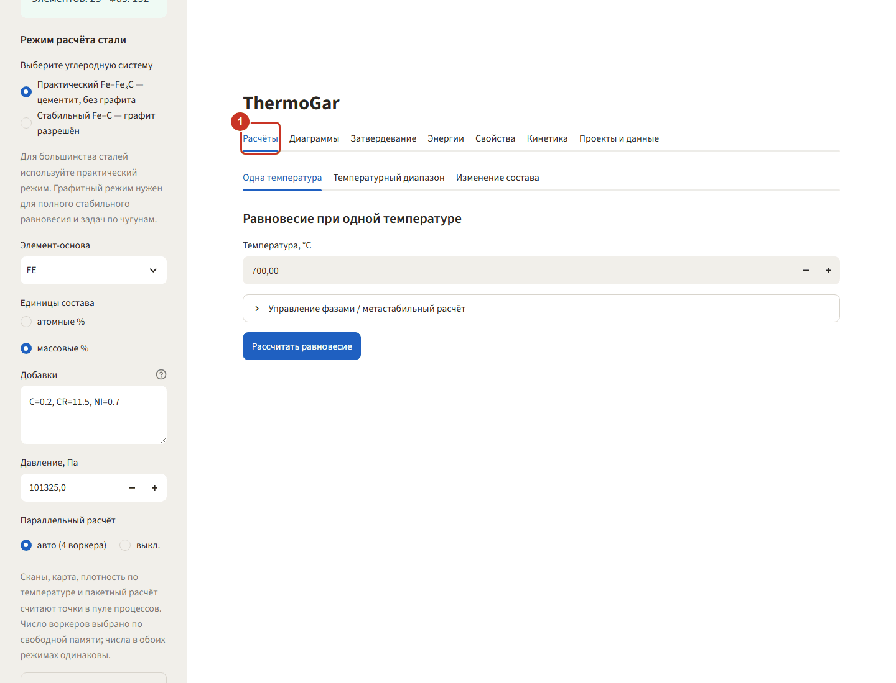
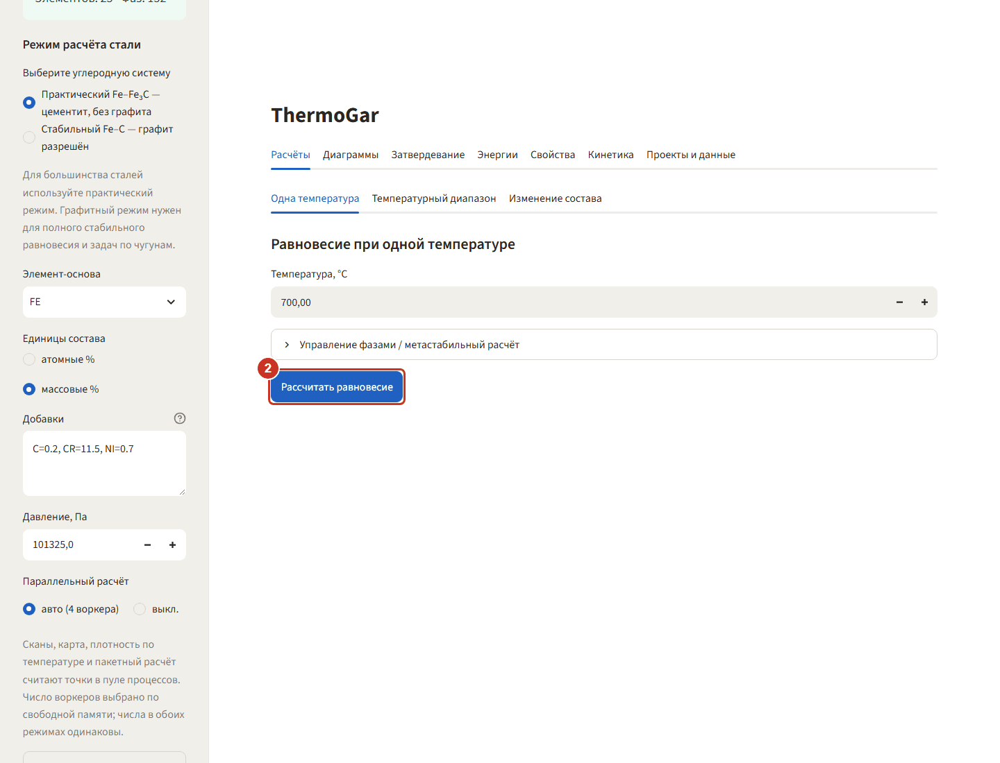
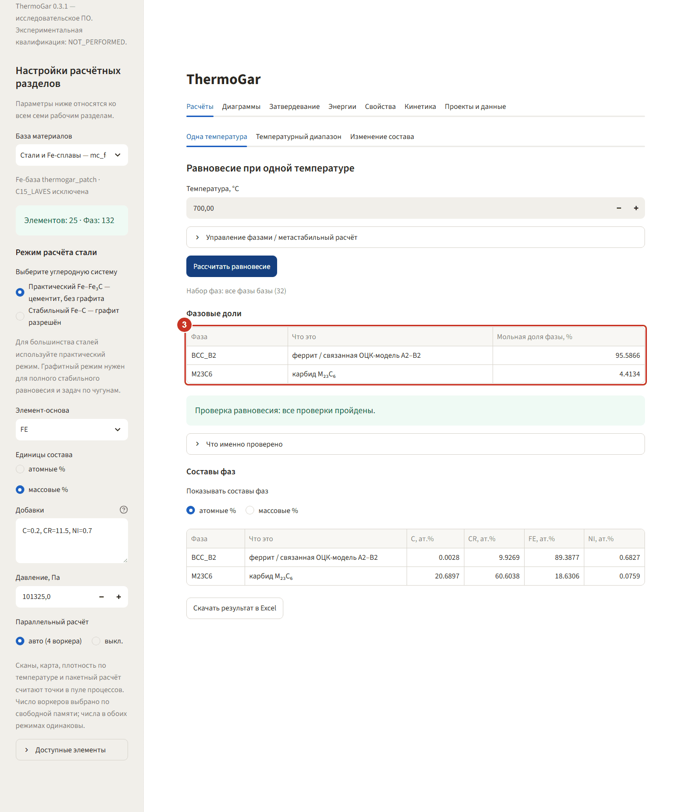
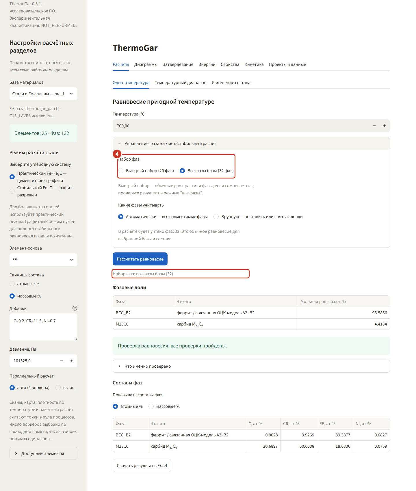
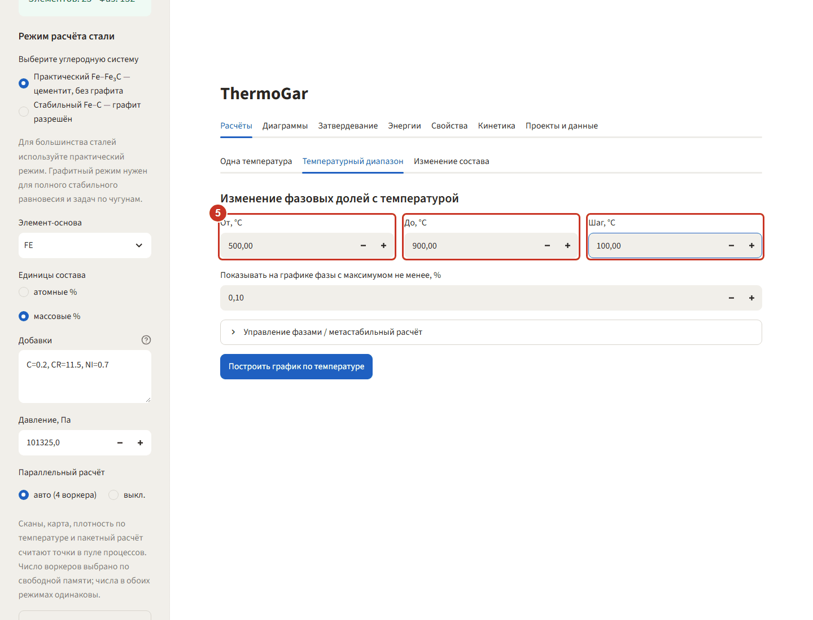
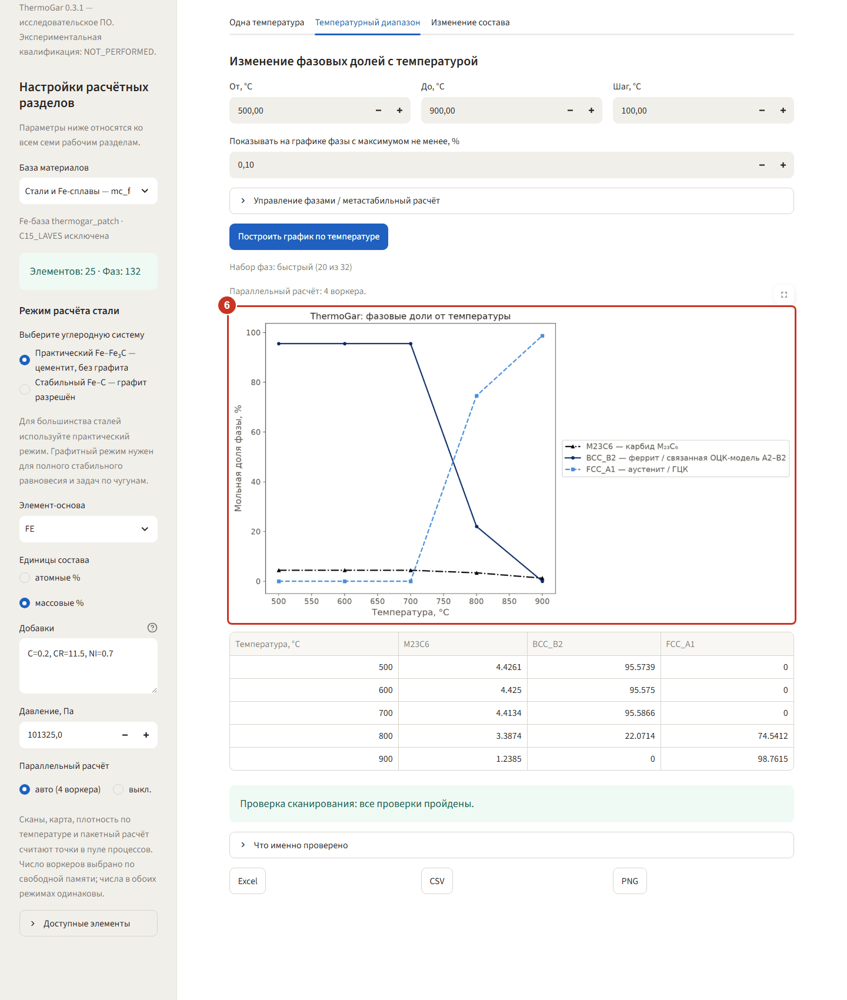
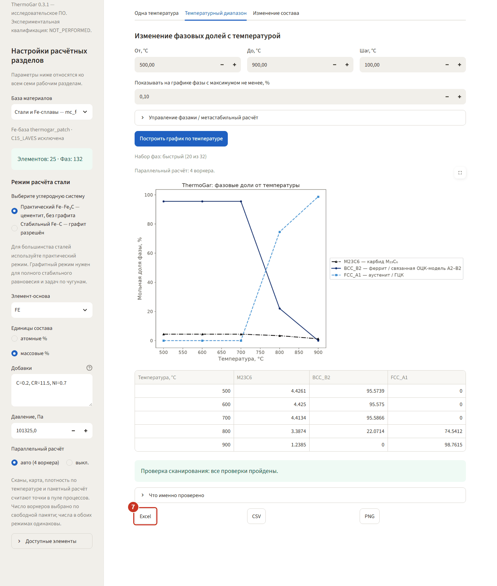

# 1. Расчёты — какие фазы устойчивы

Пример: нержавеющая сталь `C=0.2, CR=11.5, NI=0.7` (масс.%, основа FE) из
[«Первого запуска»](README.md#первый-запуск). Сначала одна точка при 700 °C, затем скан по
температуре 500–900 °C. Обе задачи считаются секундами.

### Шаг 1. Откройте вкладку «Расчёты»

Внутри раздела три подвкладки: **«Одна температура»**, **«Температурный диапазон»** и
**«Изменение состава»**. Начните с первой — температура уже стоит 700 °C.

### Шаг 2. Запустите расчёт равновесия

Нажмите **«Рассчитать равновесие»**. Пока идёт счёт, под кнопкой крутится индикатор; для стали
одна точка занимает около 15 секунд.

### Шаг 3. Прочитайте таблицу фаз

В таблице **«Фазовые доли»** — устойчивые при 700 °C фазы и их мольные доли: феррит `BCC_B2`
95,59 % и карбид `M23C6` 4,41 %. Ниже, в **«Составы фаз»**, видно, куда ушёл хром: в карбиде его
60,6 ат.%, в феррите остаётся 9,9 ат.%. Зелёная полоса «все проверки пройдены» означает, что
сумма долей и балансы по элементам сошлись.

### Шаг 4. При сомнении смените набор фаз

Разверните **«Управление фазами / метастабильный расчёт»**. Переключатель **«Быстрый набор /
Все фазы базы»** решает, сколько фаз участвует в расчёте: быстрый набор — это фазы, обычные для
практики (20 из 32 для этой стали), все фазы — полная проверка. Выбранный набор всегда написан
под результатом строкой **«Набор фаз: …»** и попадает в выгрузку.

При быстром наборе в этом же блоке стоит предупреждение о фазах, которые совместимы с составом, но
в набор не вошли: их число и не больше пяти имён, остальные — «и ещё N». Например:

> Быстрый набор не рассматривает часть фаз, совместимых с составом, — всего 20: A, B, C, D, E и ещё 15.
> Если какая-то из них устойчива на вашем составе, быстрый режим её не покажет — сверьтесь в режиме
> «все фазы базы». Полный перечень — в блоке ниже.

Полный перечень — в свёрнутом блоке **«Все фазы вне быстрого набора (N)»** под предупреждением;
блок появляется, только когда таких фаз больше пяти. Если в перечне есть фаза, которую вы ожидаете
на своём составе, пересчитайте на «Все фазы базы».

[снимок: предупреждение о фазах вне быстрого набора и раскрытый блок «Все фазы вне быстрого
набора (N)» — снять при сборке выпуска]

### Если равновесие не найдено

На части составов решатель pycalphad возвращает пустое решение — сумма долей фаз равна нулю.
Тогда таблицы нет, а под кнопкой стоит красное сообщение, например:

> Равновесие при 750.0 °C не найдено: pycalphad вернул пустое решение (сумма долей фаз равна нулю),
> поэтому результата нет — попробуйте другую температуру или состав; решатель не сходится на части
> составов, и соседние точки тоже могут оказаться пустыми.

Это значит, что решатель в этой точке не сошёлся, а не что в сплаве нет фаз; числа за такую точку
программа не подставляет. Попробуйте другую температуру или состав. Малого сдвига может не хватить:
на сплаве ЭК199 без бора пустое решение занимает всю полосу 700…750 °C при Si 4,9…5 масс. %. Скан
на никелевой или алюминиевой базе, попав на пустую точку, обрывается, и в тексте ошибки названа её
температура — сузьте диапазон так, чтобы её обойти. Сообщение проверено на никелевой базе; расчёт
на стальной базе идёт другим путём, и как он ведёт себя на пустом решении, не проверялось.

[снимок: сообщение «Равновесие при … °C не найдено» под кнопкой «Рассчитать равновесие» — снять
при сборке выпуска]

### Шаг 5. Задайте диапазон температур

Перейдите на **«Температурный диапазон»** и поставьте **От 500**, **До 900**, **Шаг 100 °C**.
Пять точек для стали считаются примерно полминуты.

### Шаг 6. Посмотрите, что происходит при нагреве

Нажмите **«Построить график по температуре»**. Видно превращение: до 700 °C сталь ферритная
(`BCC_B2` ≈ 95,6 %), при 800 °C уже 74,5 % аустенита `FCC_A1`, при 900 °C феррита не остаётся.
Карбид `M23C6` при нагреве постепенно растворяется — с 4,43 % до 1,24 %.

### Шаг 7. Выгрузите результат

Под таблицей три кнопки: **Excel**, **CSV**, **PNG**. Excel содержит три листа — параметры
расчёта (включая контрольную сумму базы), сами числа и протокол проверок.
