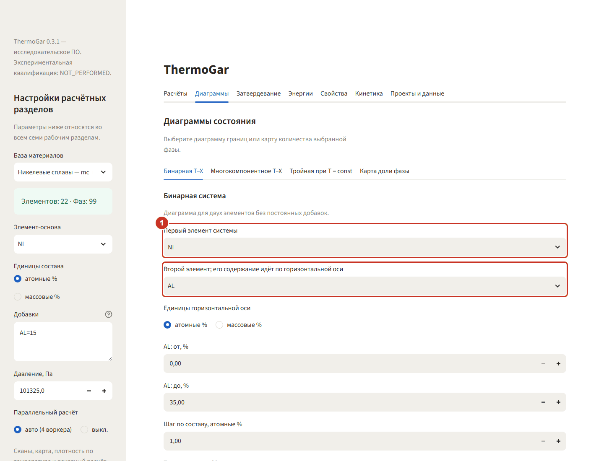
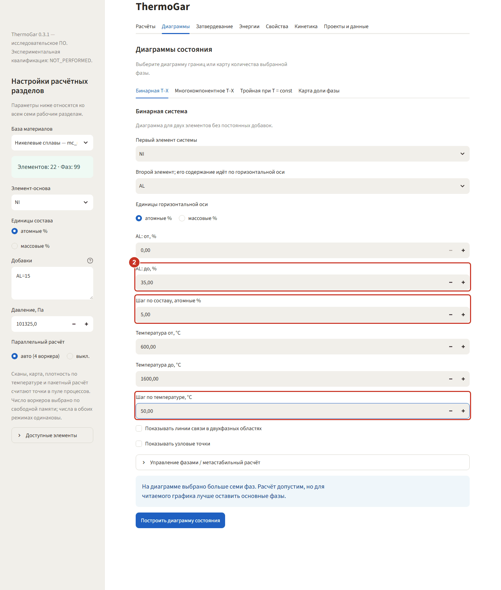
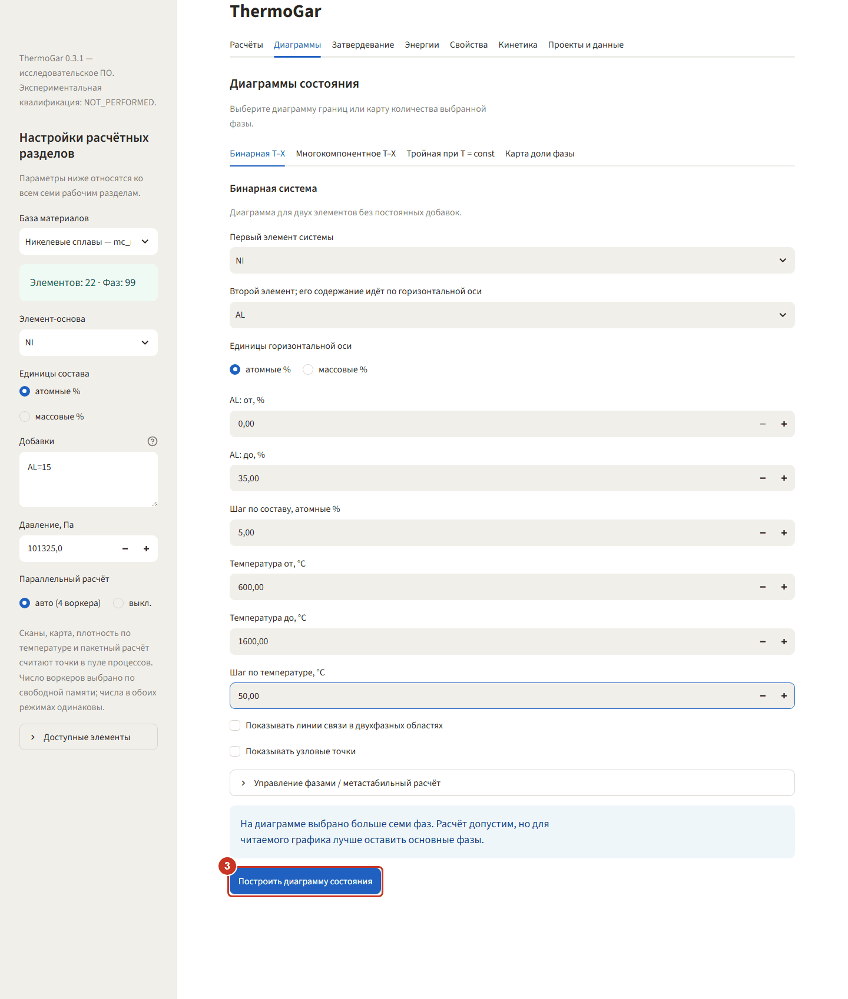
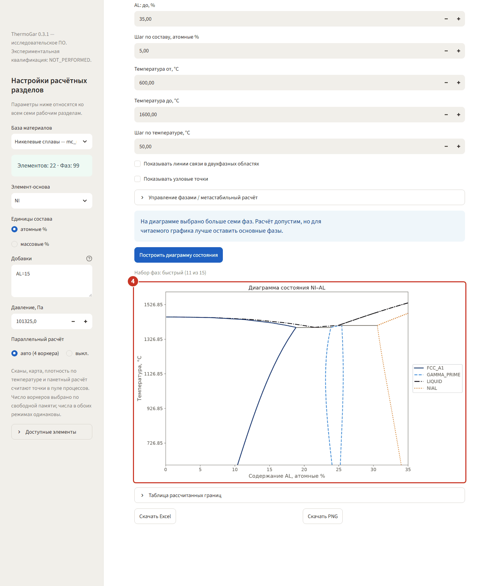
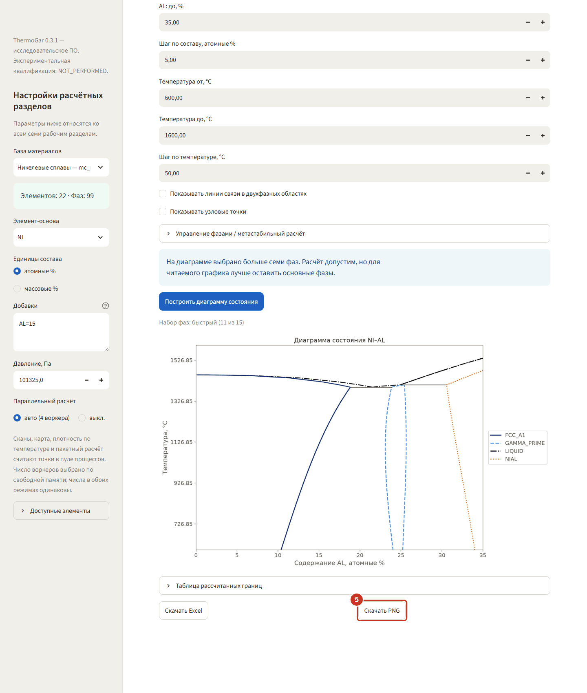

# 2. Диаграммы — бинарная Ni–Al

Пример: диаграмма состояния Ni–Al на никелевой базе. В боковой панели выберите базу
**«Никелевые сплавы — mc_ni 2.036»**; состав в панели на бинарную диаграмму не влияет — система
задаётся прямо в разделе.

Раздел даёт четыре типа построения: бинарную T–X, многокомпонентное сечение (изоплету), тройную
изотермическую диаграмму и карту доли выбранной фазы. Здесь — первая.

### Шаг 1. Выберите два элемента системы

Откройте **«Диаграммы» → «Бинарная T–X»**. **Первый элемент** — `NI`, **второй** — `AL`; его
содержание пойдёт по горизонтальной оси.

### Шаг 2. Задайте диапазон и шаг сетки

Поставьте **«Al: до, ат.%»** **35** (так и стоит по умолчанию), температуру **от 600 до 1600 °C**,
**«Шаг по составу, ат.%»** **5** и **«Шаг по температуре, °C»** **50**. Оба шага — в свёрнутом блоке
**«Точность и критерии»**: раскройте его. Шаг — главный расход времени: на такой сетке диаграмма
строится около полминуты, на шаге 10 °C и 1 % — уже минуты.

### Шаг 3. Постройте диаграмму

Нажмите **«Построить диаграмму состояния»**. Строка с кнопкой расчёта держится у нижнего края окна,
пока форма не прокручена до её места, — так во всех разделах. Над кнопкой — подпись
**«Не по умолчанию: …»**: она перечисляет поля свёрнутых блоков, которые вы изменили, здесь —
«Шаг по составу, ат.%; Шаг по температуре, °C». Если программа предупредила, что выбрано больше
семи фаз, это не ошибка: расчёт пройдёт, но график будет плотнее.

### Шаг 4. Прочитайте результат

На диаграмме видны γ-твёрдый раствор `FCC_A1`, упорядоченная γ′ `GAMMA_PRIME` (узкая область
около 23–25 ат.% Al), фаза `NIAL` справа и линия ликвидуса `LIQUID` сверху. Под графиком —
свёрнутая **«Таблица рассчитанных границ»** с координатами всех точек.

### Шаг 5. Сохраните диаграмму

**«Скачать PNG»** отдаёт картинку в том же виде, что на экране, **«Скачать Excel»** — координаты
границ и параметры расчёта. Обе кнопки под графиком.
