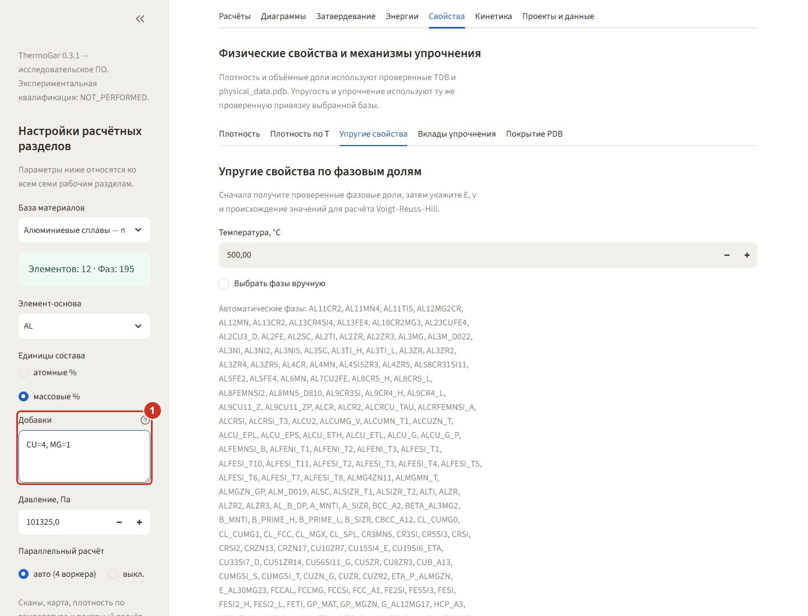
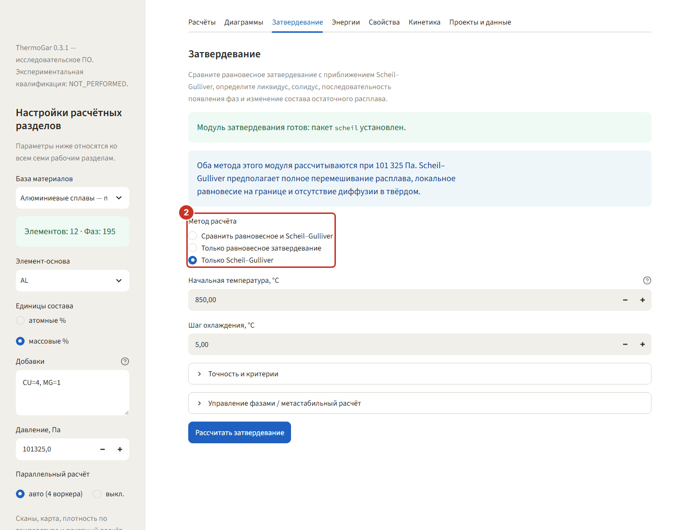
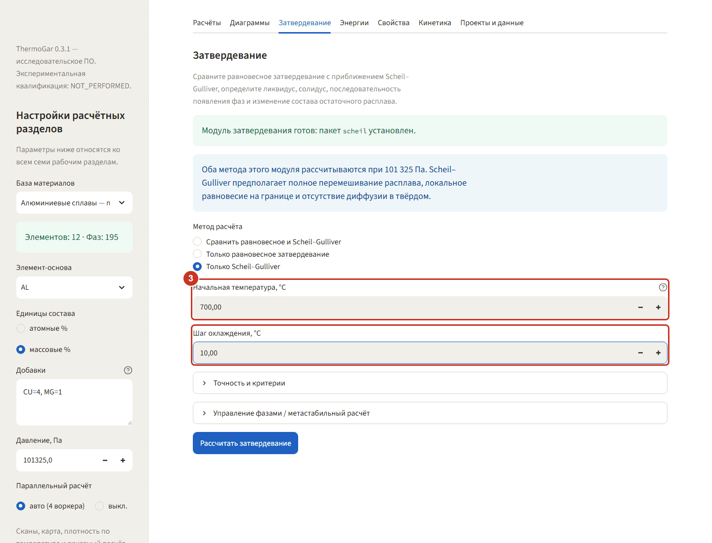
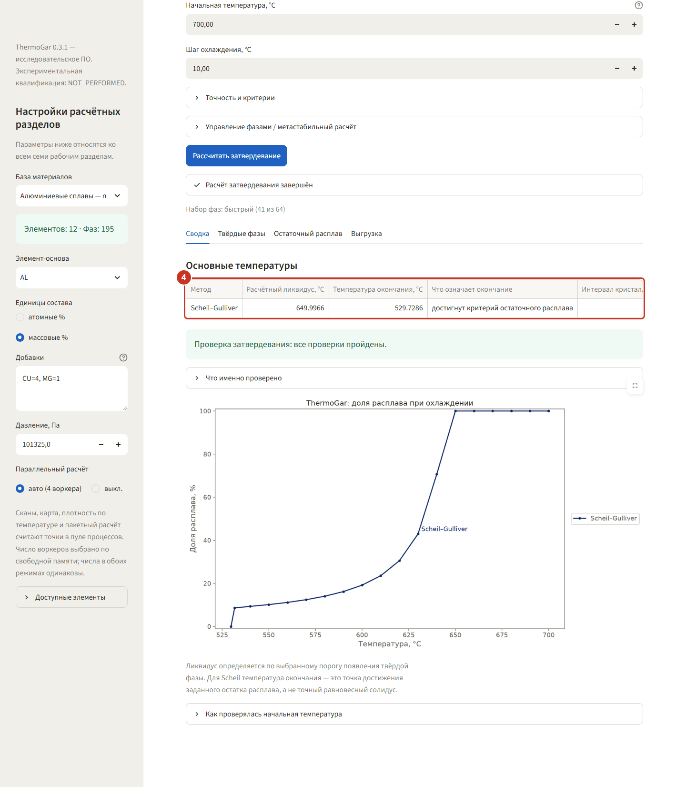
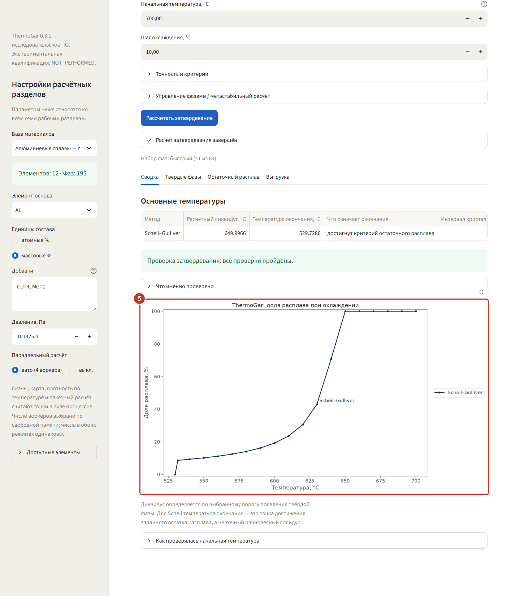
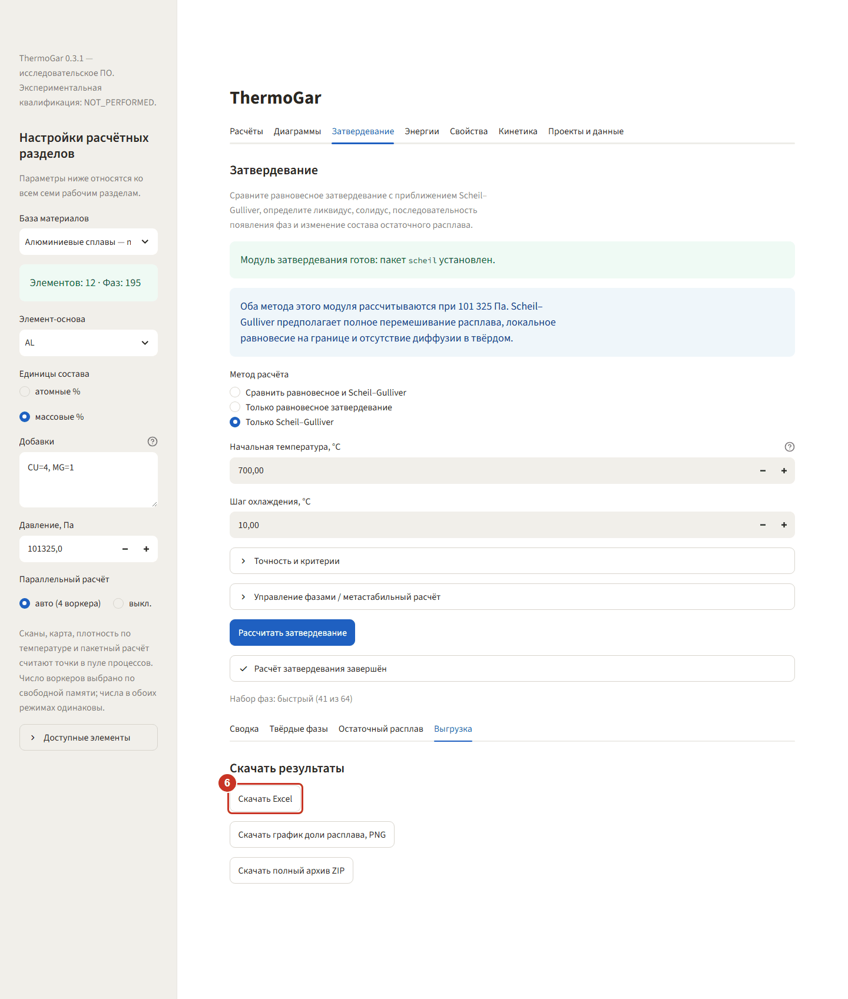

# 3. Затвердевание — Scheil для Al–4Cu–1Mg

Пример: литейный алюминиевый сплав Al–4Cu–1Mg. Модель Шейля–Гулливера считает кристаллизацию без
диффузии в твёрдой фазе — это оценка «сверху» для литья, сварки и аддитивных процессов с быстрым
охлаждением.

### Шаг 1. Смените базу и состав

В боковой панели выберите базу **«Алюминиевые сплавы — mc_al 2.037»**, единицы —
**массовые %**, в поле **«Добавки»** введите `CU=4, MG=1`. Основа `AL` подставится сама.

### Шаг 2. Выберите метод

На вкладке **«Затвердевание»** в списке **«Метод расчёта»** есть три варианта. Возьмите
**«Только Scheil–Gulliver»**: он считается быстрее, чем сравнение с равновесным.

### Шаг 3. Задайте старт и шаг охлаждения

**Начальная температура 700 °C** — заведомо выше ликвидуса этого сплава, **шаг охлаждения 10 °C**.
Если задать старт ниже ликвидуса, программа сама поднимет температуру до однофазного расплава и
покажет, как она это сделала.

### Шаг 4. Прочитайте ликвидус и температуру окончания

Нажмите **«Рассчитать затвердевание»**. В **«Сводке»**: расчётный ликвидус 650,0 °C, окончание
529,7 °C. Для Шейля «окончание» — это момент, когда остаток расплава упал до заданного порога
(по умолчанию 5 %), а не равновесный солидус: у неравновесной кристаллизации последние капли
жидкости тянутся до эвтектики.

### Шаг 5. Посмотрите кривую

График показывает долю расплава по температуре. Между 650 и 640 °C затвердевает больше половины
объёма, дальше кривая идёт полого — это обогащённый медью и магнием остаточный расплав, из
которого и вырастут междендритные интерметаллиды. Их список — на подвкладке
**«Твёрдые фазы»**.

### Шаг 6. Выгрузите результат

Подвкладка **«Выгрузка»** → **«Скачать Excel»**: температуры, доли фаз по шагам и параметры
расчёта одним файлом. Рядом — PNG с кривой и ZIP со всем сразу.
