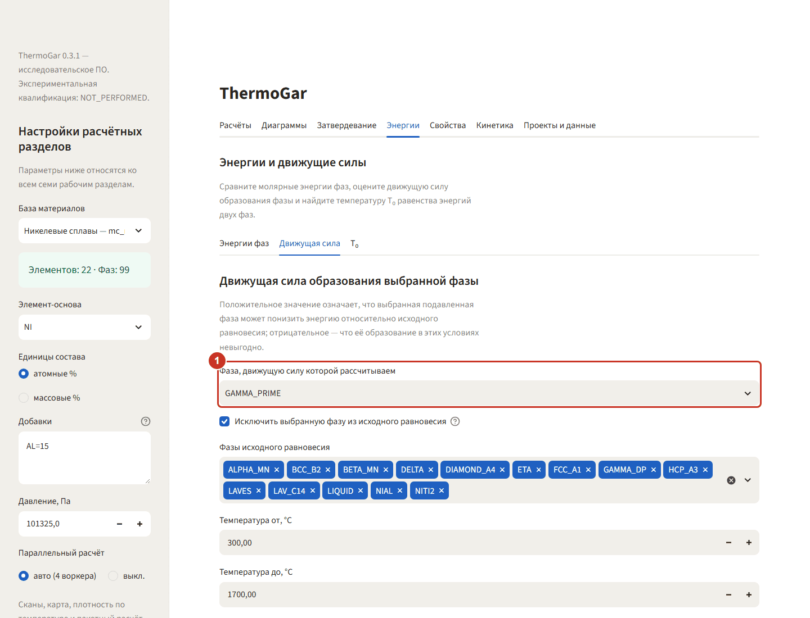
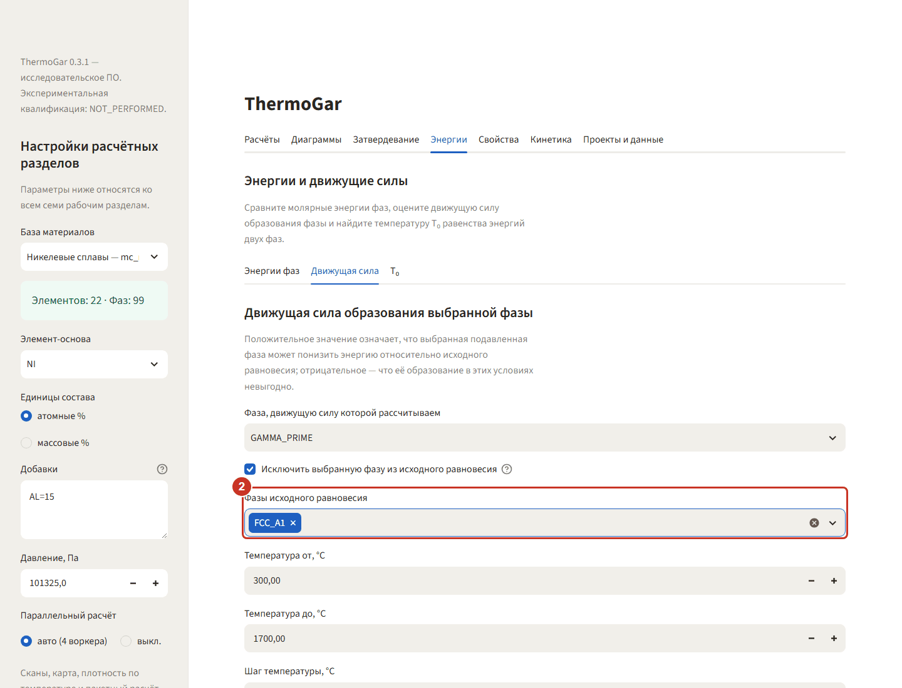
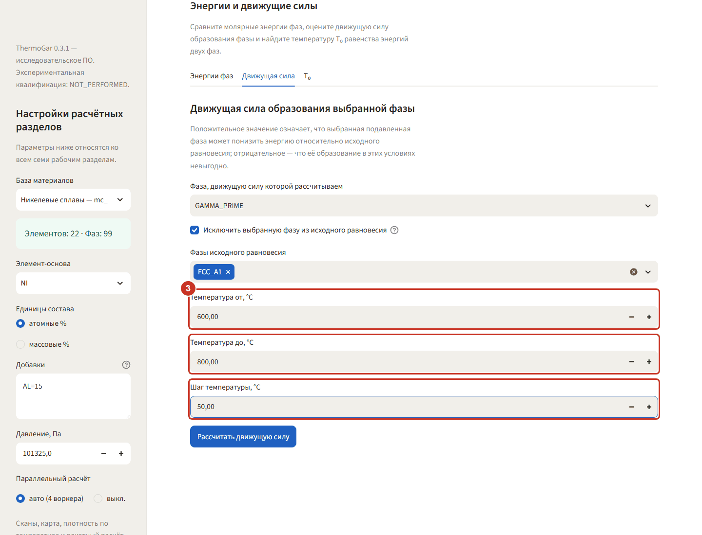
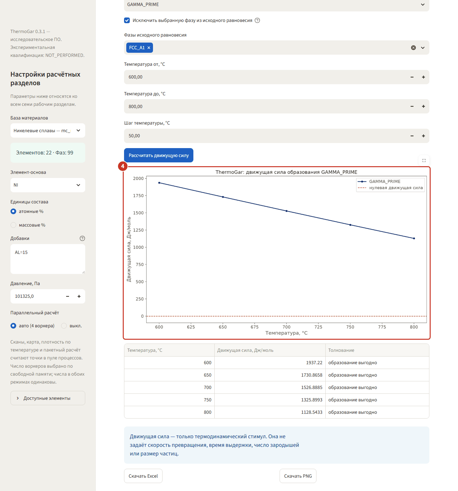
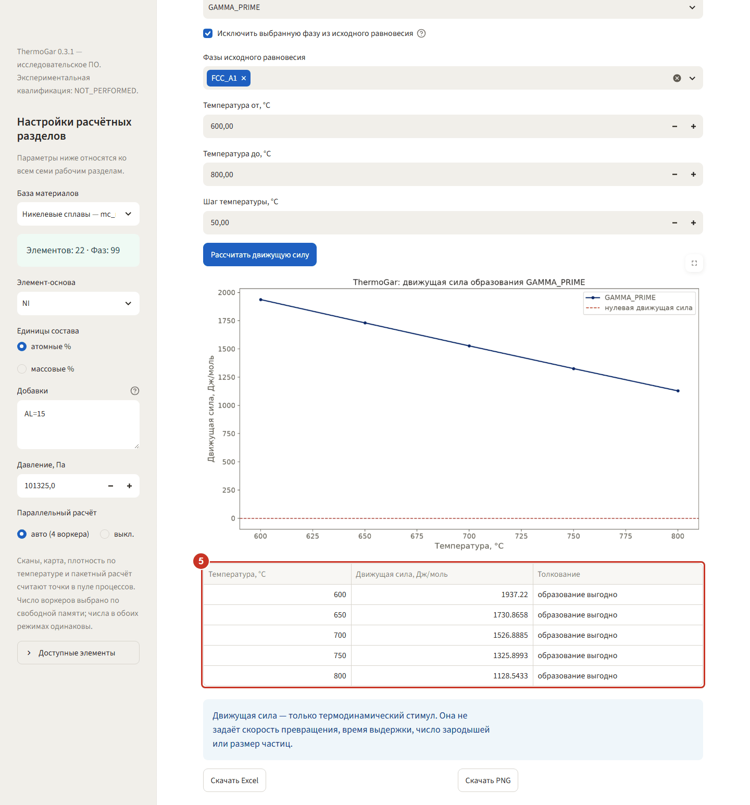

# 4. Энергии — движущая сила выделения γ′

Пример: никелевый сплав Ni–15Al (ат.%). Вопрос простой: есть ли термодинамический стимул к
выделению γ′ из γ-матрицы при 700 °C и как он меняется с температурой.

В боковой панели должна стоять база **«Никелевые сплавы — mc_ni 2.036»**, единицы —
**атомные %**, **«Добавки»** — `AL=15`.

### Шаг 1. Выберите фазу-продукт

Откройте **«Энергии» → «Движущая сила»**. В списке **«Фаза, движущую силу которой рассчитываем»**
поставьте `GAMMA_PRIME`. Галочка **«Исключить выбранную фазу из исходного равновесия»** должна
быть включена: движущая сила считается относительно состояния, в котором γ′ ещё нет.

### Шаг 2. Оставьте только матрицу

В поле **«Фазы исходного равновесия»** уберите лишнее и оставьте `FCC_A1`. Тогда результат — это
выигрыш энергии при появлении γ′ в чистой γ-матрице, без вклада других фаз.

### Шаг 3. Задайте окно температур

**От 600 до 800 °C**, **шаг 50 °C**. Каждая точка — отдельный расчёт равновесия, поэтому широкое
окно с мелким шагом считается долго; для ответа «есть стимул или нет» хватает пяти точек.

### Шаг 4. Прочитайте график

Нажмите **«Рассчитать движущую силу»**. Красный пунктир — нулевая линия. Кривая идёт выше неё во
всём окне: γ′ выгодна и при 600, и при 800 °C, но с нагревом стимул слабеет — 1937 Дж/моль при
600 °C и 1129 Дж/моль при 800 °C.

### Шаг 5. Возьмите числа из таблицы

В таблице под графиком те же значения с толкованием: при 700 °C движущая сила 1526,9 Дж/моль,
«образование выгодно». Движущая сила — это только стимул: скорость выделения, время выдержки и
размер частиц она не задаёт, для этого есть [раздел «Кинетика»](06-kinetika.md).
