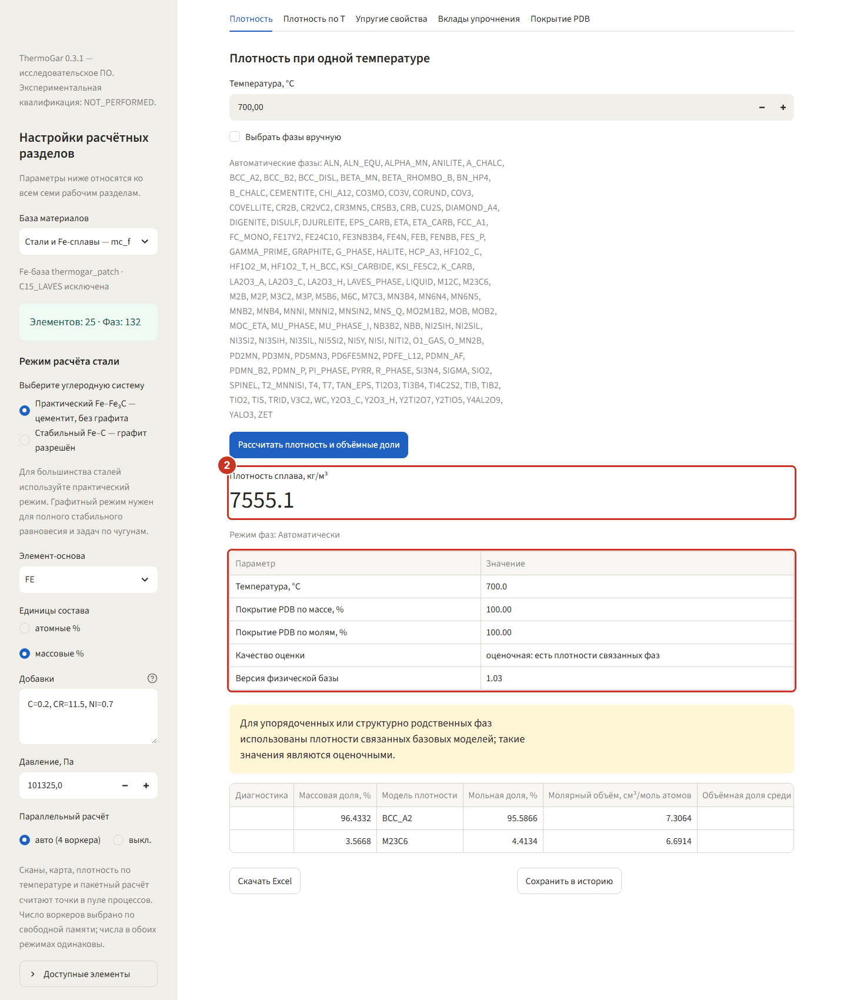
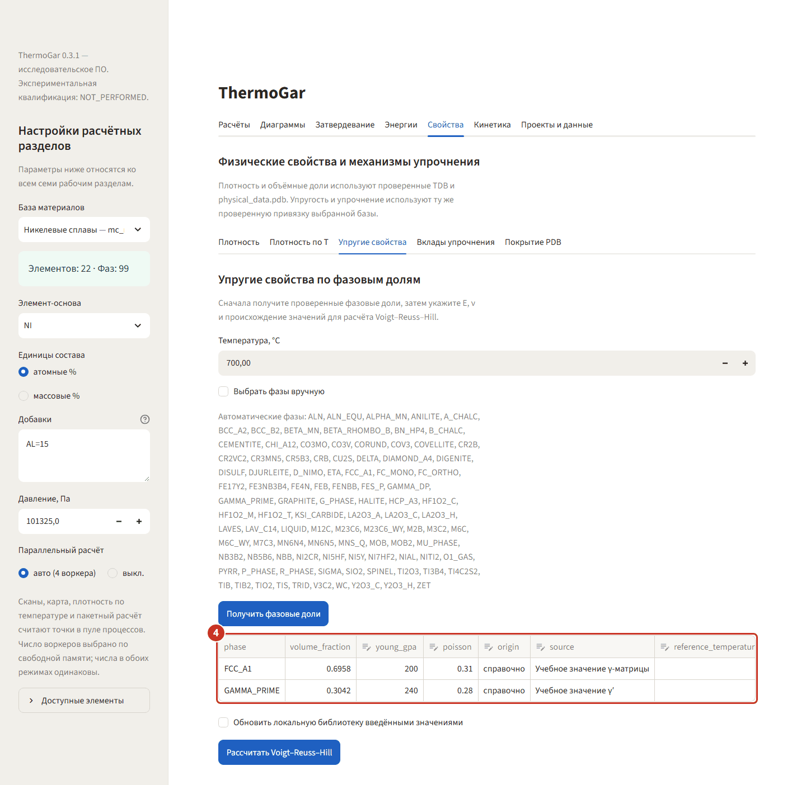
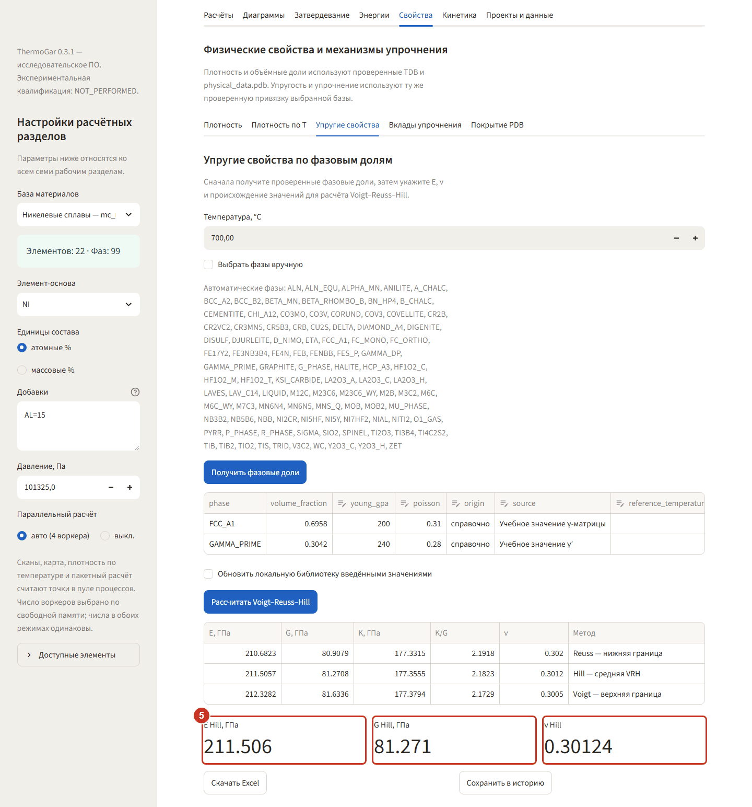

# 5. Свойства — плотность и модули упругости

Раздел считает свойства многофазного сплава по долям фаз: плотность — из базы физических данных
`physical_data.pdb`, упругие модули — по Фойгту–Ройссу–Хиллу из модулей отдельных фаз, которые
задаёт пользователь. Два примера: плотность стали и модули никелевого сплава.

## Плотность стали

### Шаг 1. Запустите расчёт плотности

С базой **«Стали и Fe-сплавы»** и составом `C=0.2, CR=11.5, NI=0.7` откройте **«Свойства» →
«Плотность»**, оставьте 700 °C и нажмите **«Рассчитать плотность и объёмные доли»**.

### Шаг 2. Прочитайте результат и покрытие базы

Плотность сплава 7555,1 кг/м³. Ниже — важные строки: **покрытие PDB по массе 100 %** (для всех
равновесных фаз есть модель плотности) и **качество оценки** — «оценочная: есть плотности
связанных фаз». Если покрытие меньше 100 %, поле плотности останется пустым: программа не
достраивает недостающие данные.

## Модули упругости никелевого сплава

### Шаг 3. Получите фазовые доли

Переключите базу на **«Никелевые сплавы»** (состав `AL=15`, атомные %) и откройте
**«Упругие свойства»**. Расчёт идёт в два приёма: сначала **«Получить фазовые доли»** при 700 °C.

### Шаг 4. Заполните модули фаз

В таблице появятся фазы с их объёмными долями: `FCC_A1` 0,696 и `GAMMA_PRIME` 0,304. Для каждой
нужно указать модуль Юнга `E`, коэффициент Пуассона `ν`, происхождение значения и источник — без
происхождения расчёт не запустится. В примере взяты учебные 200 ГПа / 0,31 для матрицы и
240 ГПа / 0,28 для γ′.

### Шаг 5. Посчитайте Voigt–Reuss–Hill

Нажмите **«Рассчитать Voigt–Reuss–Hill»**. Верхняя и нижняя границы (Фойгт и Ройсс) и среднее по
Хиллу: E = 211,5 ГПа, G = 81,3 ГПа, ν = 0,301. Разброс между границами здесь около 1,6 ГПа —
это мера того, насколько результат зависит от геометрии смеси фаз.

На соседних подвкладках — **«Плотность по T»** (та же плотность кривой по температуре) и
**«Вклады упрочнения»** (Холл–Петч, Тейлор, Орован по вашим коэффициентам).
