# 6. Кинетика — старение γ′ и диффузионная пара

Раздел отвечает на вопрос «сколько держать и при какой температуре». Две подвкладки:
**«Выделения»** — модель KWN (зарождение, рост, огрубление) и **«Диффузия и гомогенизация»** —
одномерная диффузия на подвижностях базы. Оба расчёта идут через открытый решатель Kawin и
объявлены исследовательскими.

Пример на никелевой базе, состав в боковой панели — `AL=15` (атомные %).

## Старение γ′

### Шаг 1. Проверьте, откуда берётся состав

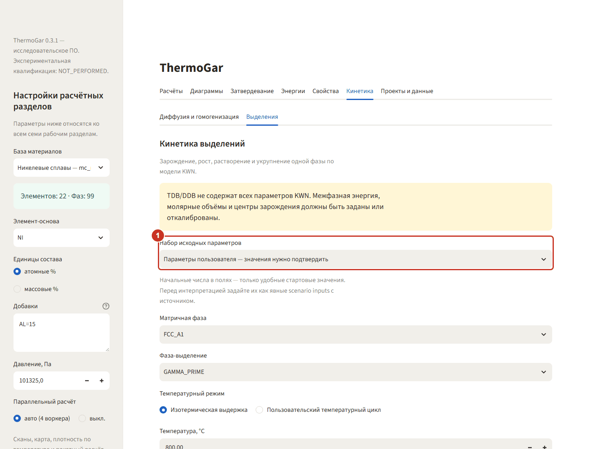

**«Кинетика» → «Выделения»**. В режиме **«Параметры пользователя»** состав берётся из боковой
панели — здесь это Ni–15Al. Рядом в списке есть учебный набор Ni–9,8Al–8,3Cr со своими
параметрами; он не зависит от боковой панели и нужен для проверки программы.

### Шаг 2. Выберите пару фаз

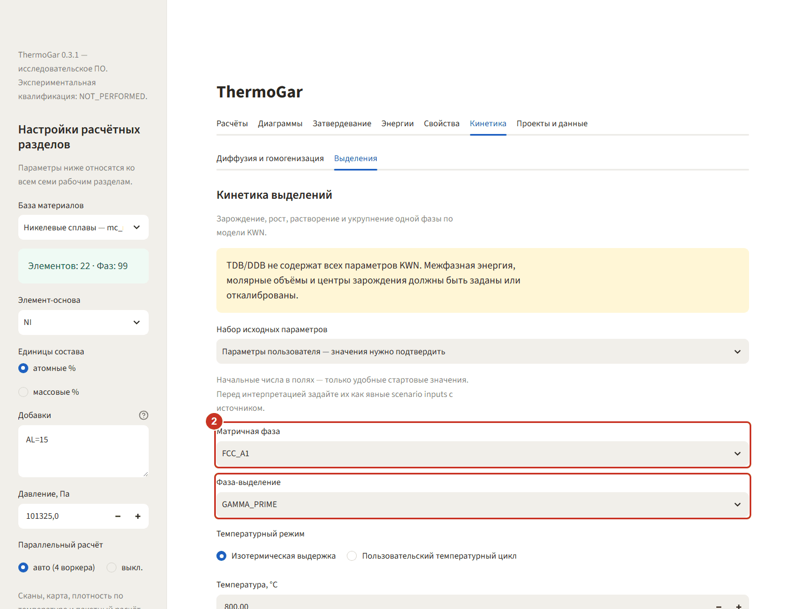

**Матричная фаза** — `FCC_A1` (γ), **фаза-выделение** — `GAMMA_PRIME` (γ′). Матрицей может быть
только фаза, у которой в базе есть параметры подвижности для всех элементов состава.

### Шаг 3. Задайте выдержку

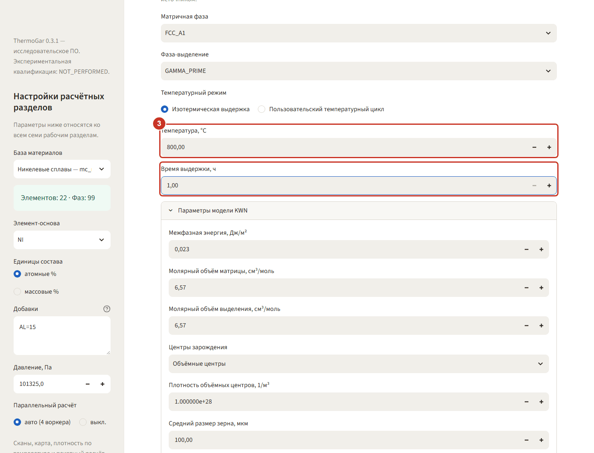

Изотермическая выдержка **800 °C**, **время 1 ч**. Время здесь модельное: минута счёта примерно
на час выдержки, поэтому длинный режим сначала прикидывают на коротком времени.

### Шаг 4. Задайте параметры, которых нет в базе

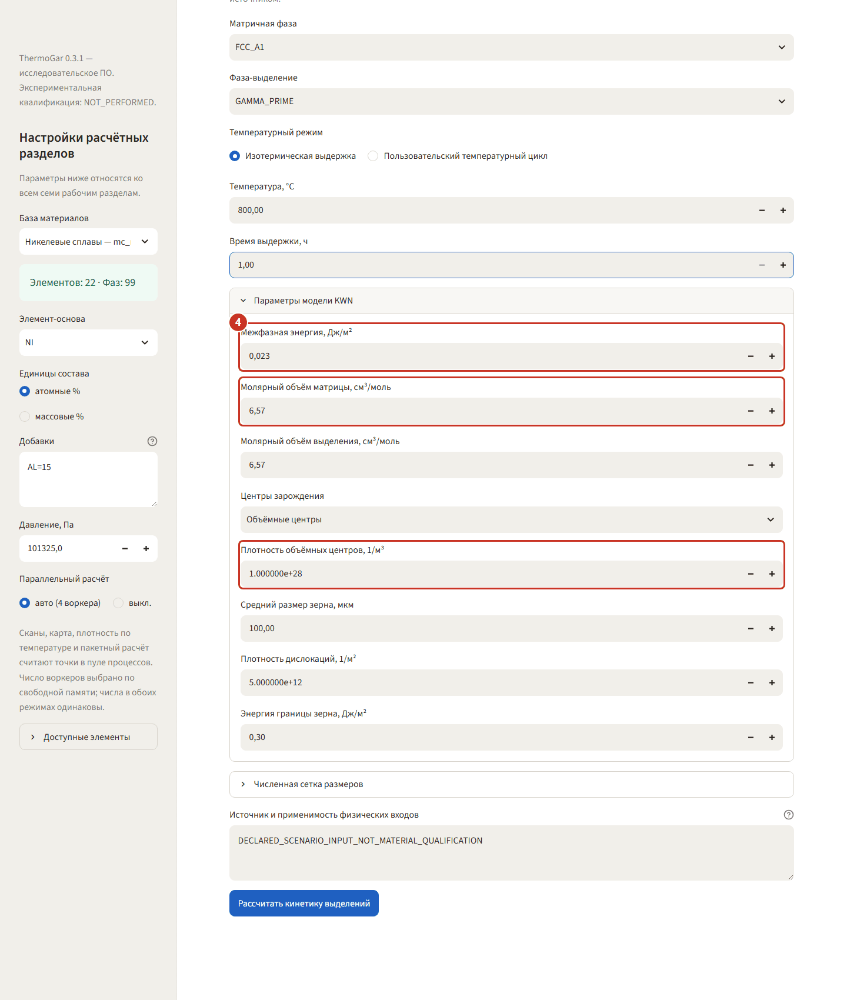

Межфазная энергия γ = 0,023 Дж/м², молярные объёмы 6,57 см³/моль и плотность центров зарождения
10²⁸ 1/м³ — это входы модели, а не данные TDB. Программа прямо об этом предупреждает: числа в
полях лишь удобные стартовые значения, для интерпретации их нужно откалибровать и указать
источник.

### Шаг 5. Посмотрите долю и размер частиц

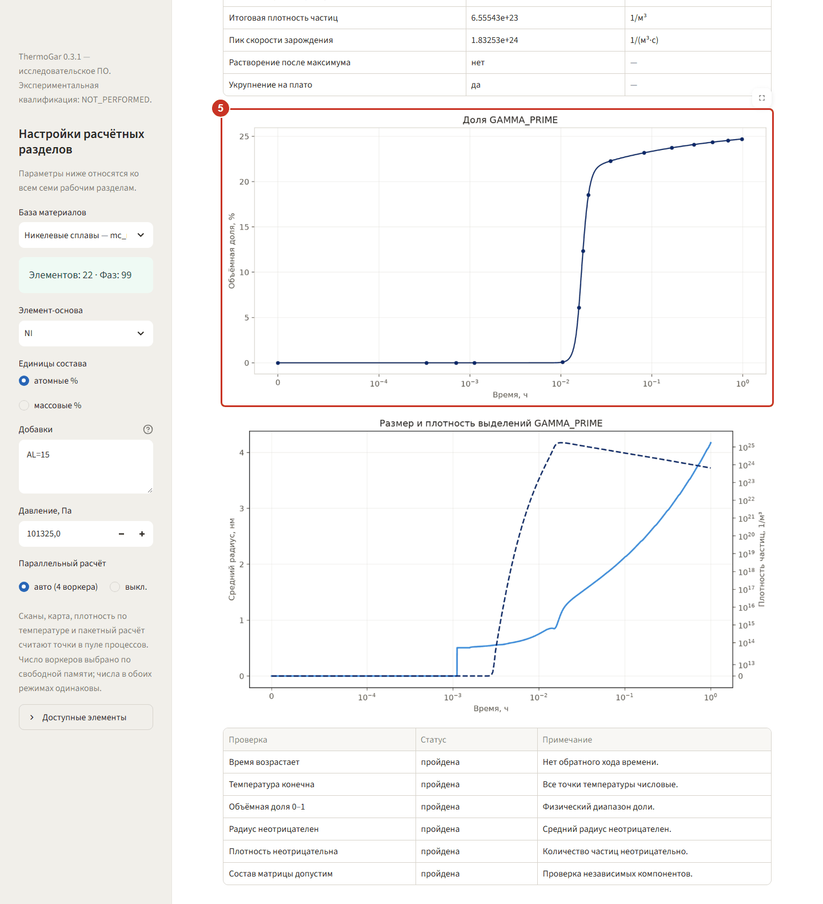

Нажмите **«Рассчитать кинетику выделений»**. Верхний график — объёмная доля γ′ по времени
(логарифмическая шкала): до 0,01 ч ничего не происходит, за следующие несколько минут доля
выходит на 24,7 %. Нижний график — средний радиус (около 4 нм к концу выдержки) и плотность
частиц 6,6·10²³ 1/м³. В сводке над графиками отмечено «Укрупнение на плато: да» — начался рост
крупных частиц за счёт мелких.

### Если расчёт предупреждает или останавливается

Состав раздела может содержать до **10 добавок** к основе. Если добавок больше четырёх, над
вкладками появляется предупреждение о времени: расчёт идёт в этой же вкладке, не отменяется, и
каждая добавка удлиняет его примерно на 15 %. Это не ошибка — дождитесь конца или уберите из
состава элементы, не влияющие на выделение.

До начала счёта раздел проверяет входы, по ходу счёта — состав матрицы. Что означают сообщения и
что делать:

* **«Критический радиус зародыша … меньше предела модели … более чем в полтора раза».** Расчёт не
  запущен: на таких входах он может не закончиться вовсе и заморозить вкладку. Поднимите межфазную
  энергию либо температуру.
* **«Критический радиус зародыша … меньше предела модели …, и kawin считает зарождение от
  предела».** Расчёт идёт, но скорость зарождения на начальной стадии не классическая, и начало
  выделения на графиках может быть искажено. Для выводов о начале выделения поднимите межфазную
  энергию либо температуру так, чтобы предупреждение ушло.
* **«Радиус зародыша … больше начального максимального радиуса сетки …».** Расчёт идёт. Итоговые
  доля, радиус и число частиц почти не меняются, но начало зарождения на графиках искажено. Полный
  текст, например:

  > Радиус зародыша 1.02 нм (оценка при 800.0 °C) больше начального максимального радиуса сетки 0.5 нм,
  > поэтому первые зародыши записываются мельче своего размера, пока kawin не достроит сетку. Итоговые
  > доля, радиус и число частиц от этого почти не меняются, но начало зарождения на графиках искажено:
  > доля и радиус занижены, число частиц завышено. Задайте «Начальный максимальный радиус» больше 1.02 нм.

  Увеличьте «Начальный максимальный радиус», как сказано в тексте, и пересчитайте.
* **«Расчёт остановлен на … с модельного времени: доля … в матрице стала 0 ат. %».** Добавка
  вычерпана из матрицы, баланс масс нарушен. Графики и таблицы показывают часть расчёта до
  остановки, строка «Состав матрицы допустим» в таблице проверок отмечена ошибкой. Пример:

  > Расчёт остановлен на 2.011 с модельного времени (0.0005586 ч): доля NB в матрице стала 0 ат. %,
  > баланс масс нарушен. Показана часть расчёта до остановки. Причина: при движущей силе по базе
  > зарождение практически безбарьерное, и выделение вычерпывает добавки из матрицы быстрее, чем модель
  > это выдерживает; см. docs/LIMITS_OF_APPLICABILITY.md.

  Если pycalphad успевает упасть делением на ноль раньше, текст начинается словами «Расчёт прерван
  после … с модельного времени» и называет последний посчитанный состав матрицы. Досчитать такой
  случай до конца программа не может: причина во входах — база даёт завышенную движущую силу, — а
  не в решателе, и перезапуск с теми же входами остановится так же. Так ведёт себя, например,
  Inconel 718 при 700 и 750 °C; разбор — `docs/LIMITS_OF_APPLICABILITY.md`, раздел «Кинетика:
  обрыв расчёта и ошибка равновесия — один дефект».

На снимках — тот же сплав 718 при 700 °C и 95 мДж/м² на сетке раздела по умолчанию (0,2…10 нм,
80 классов): остановка наступает на 3,888 с, а не на 2,011 с, как в примере выше (там сетка
0,1…50 нм, 800 классов).

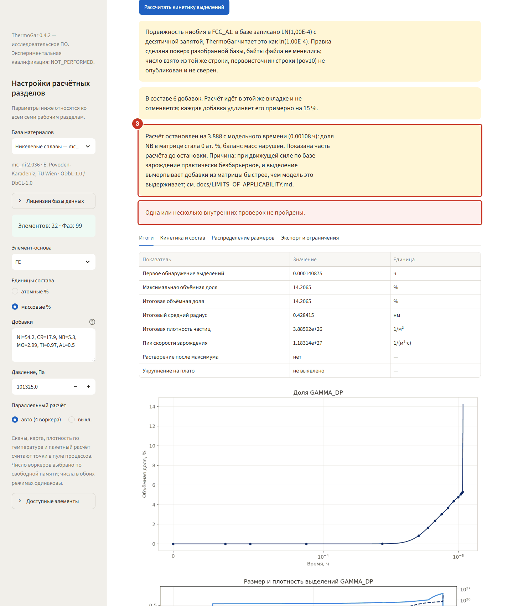

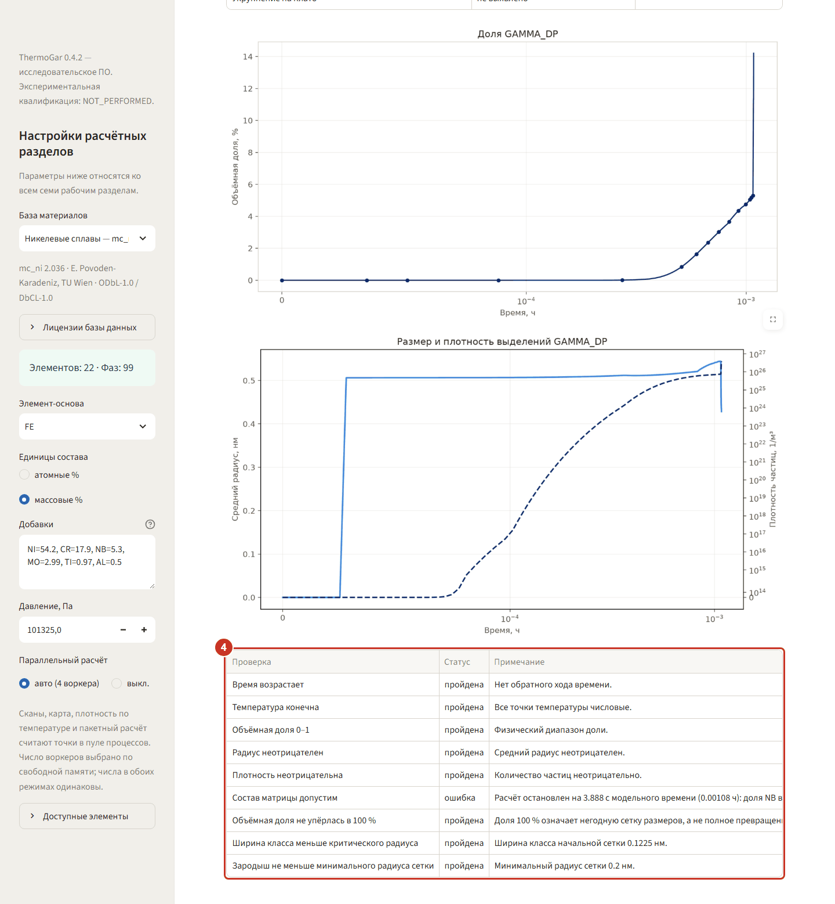

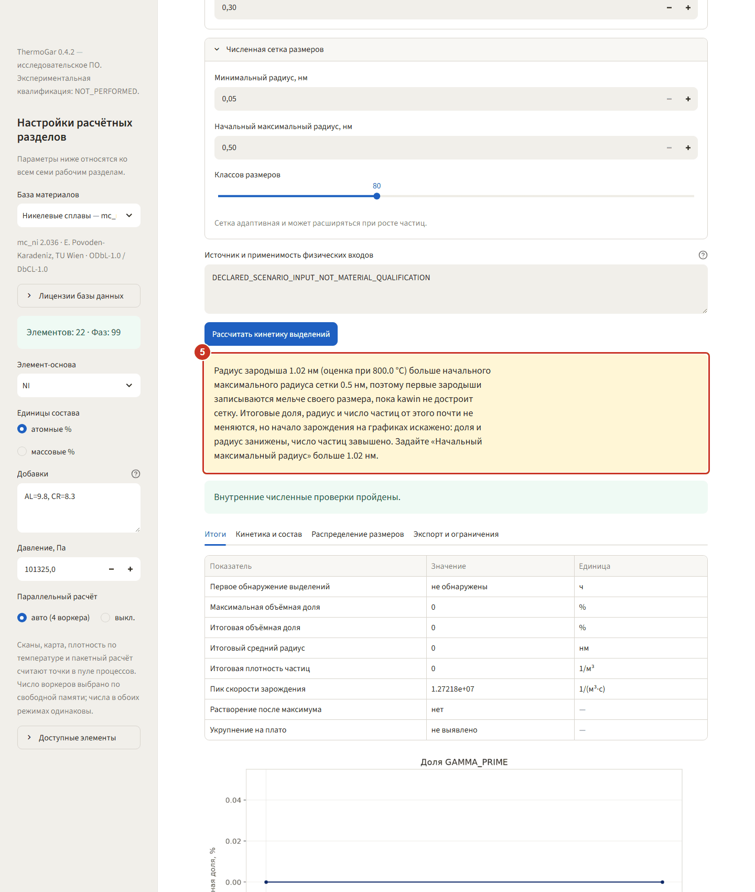

## Диффузионная пара

### Шаг 6. Задайте составы половин

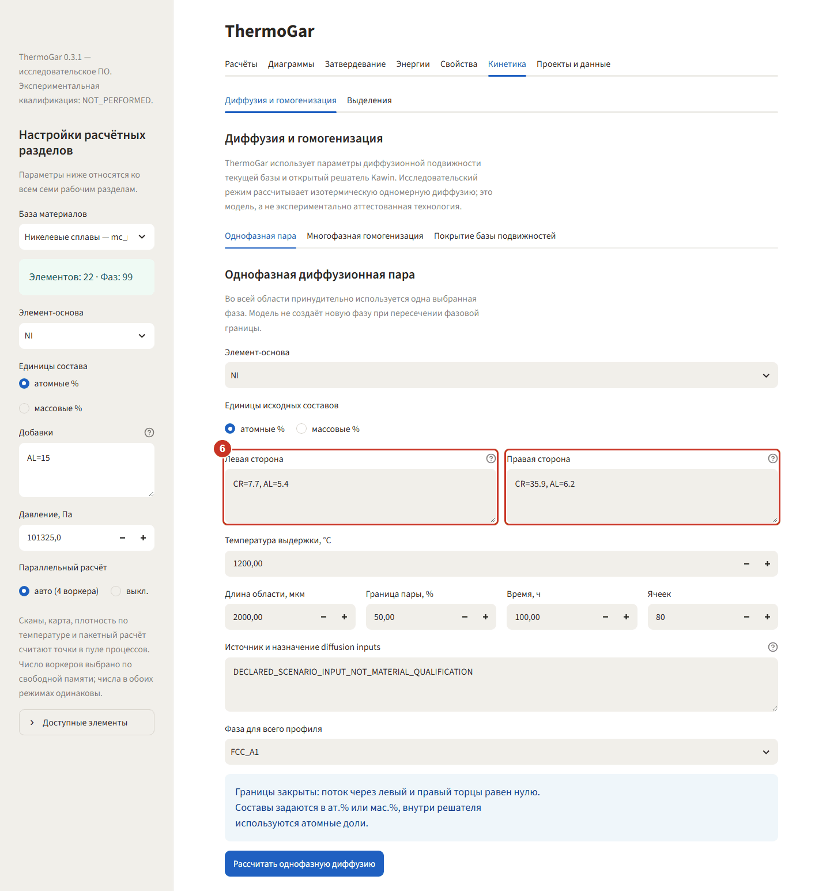

**«Диффузия и гомогенизация» → «Однофазная пара»**. Слева `CR=7.7, AL=5.4`, справа
`CR=35.9, AL=6.2` (ат.%, основа NI) — модель пары «сплав — покрытие». Границы закрыты: поток
через торцы равен нулю, средний состав должен сохраниться.

### Шаг 7. Проверьте режим и сетку

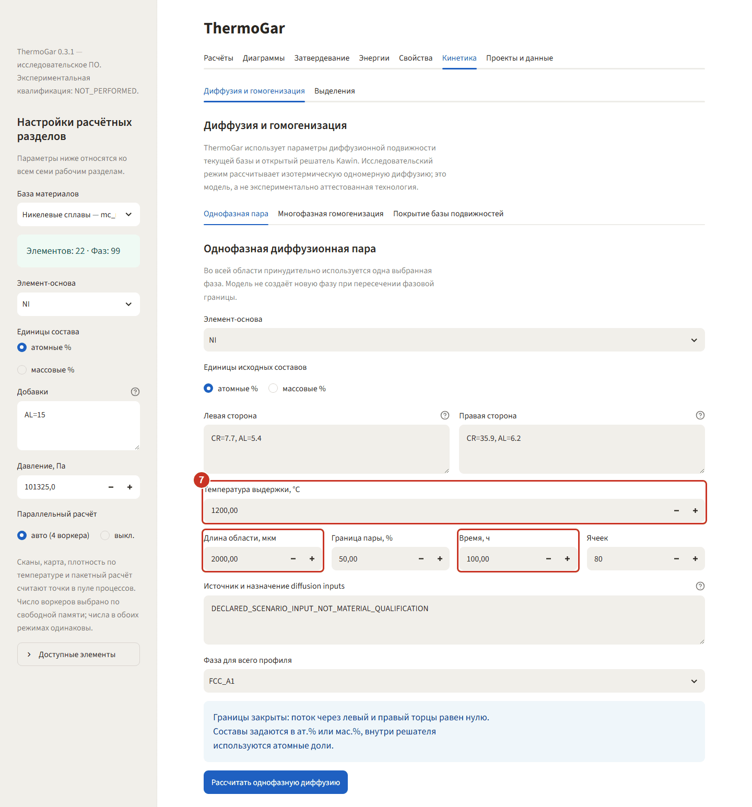

**1200 °C, 100 ч**, зона 2000 мкм, 80 ячеек — значения по умолчанию. Сетку лучше не сгущать без
нужды: на той же выдержке и 200 мкм численная невязка баланса выходит за допустимую, и программа
об этом сообщает.

### Шаг 8. Прочитайте профиль

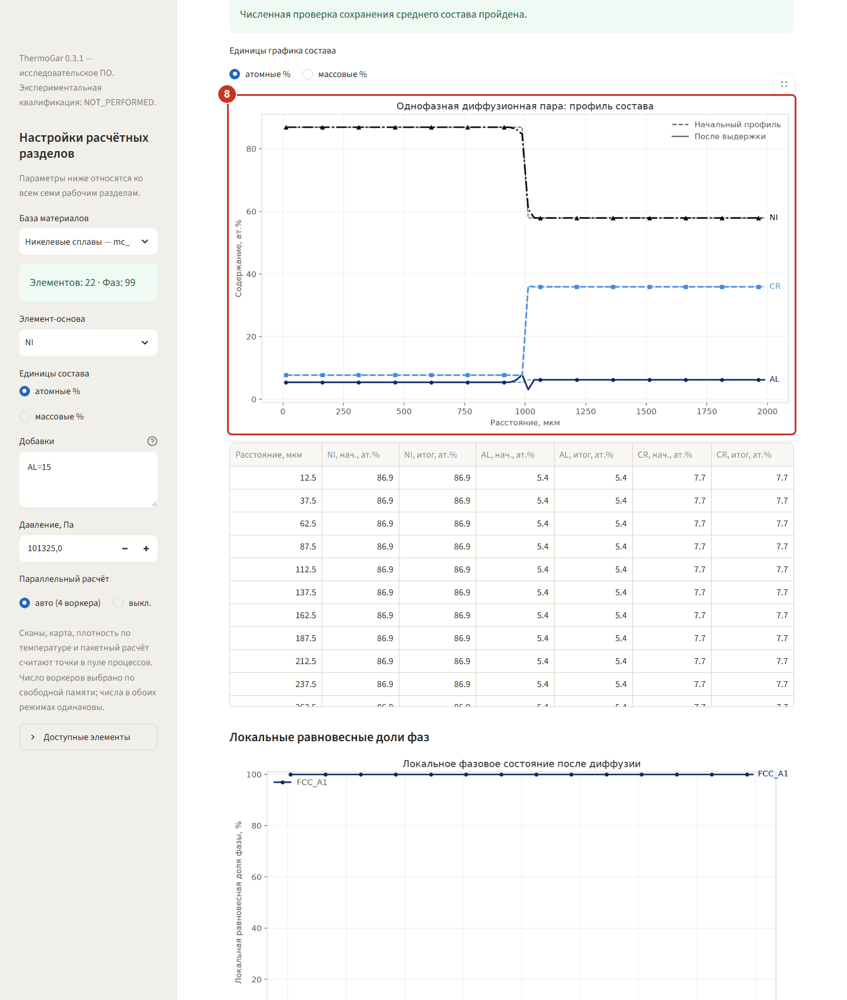

Пунктир — исходный ступенчатый профиль, сплошная линия — состав после выдержки. За 100 ч при
1200 °C перемешивание захватывает лишь несколько десятков микрон около границы: на длине 2000 мкм
это узкая полоса, а ликвация масштаба сотен микрон за такую выдержку не выравнивается. Над
графиком метрика **«Макс. ошибка баланса»** и зелёная полоса «проверка сохранения среднего
состава пройдена» — без неё результат использовать нельзя.

### По какой величине считается баланс

**Сохраняется средняя u-доля, а не средняя мольная.** u-доля — это `u = x / сумма замещающих
элементов`. Решатель `kawin` ведёт расчёт в объёмно-фиксированной системе отсчёта и хранит
состояние именно в u-долях, потому что внедрённый элемент (C, N, O, H, B) сидит в междоузлиях и
узлов решётки не создаёт: количество вещества на единицу объёма пропорционально u, а не x. При
закрытых границах конечно-объёмная схема сохраняет среднюю u-долю; средняя мольная доля
сохраняться не обязана — знаменатель «сумма замещающих» меняется от узла к узлу, и перенос
углерода его перераспределяет.

Поэтому **невязка считается по u-долям**, и величина названа явно: в подписи под метрикой и в
строке «Сохраняющаяся величина баланса» в параметрах расчёта, которые уходят в выгрузку. Таблица
баланса при этом по-прежнему показывает **мольные доли (ат. %)** — в работе нужны они; столбцы
u-долей добавляются только там, где отличаются от мольных, то есть когда в паре есть внедрённый
элемент.

Правило общее, не особенность железа: **любая проверка баланса в системе с C, N, O, H или B
должна считаться по u-долям**. Список внедрённых элементов берётся из самого `kawin`
(`kawin.thermo.Mobility.interstitials`), а не заводится в программе заново.

Числа для подтверждения (волна 11L, три базы): на железе (пара FE–C–CR) невязка по мольным долям
**7,24·10⁻⁶** при допуске 1·10⁻⁶, по u-долям — **3,38·10⁻⁸**. На никеле и алюминии после
перехода на u-доли значения не изменились ни на бит (6,00·10⁻⁸ и 2,00·10⁻⁸): внедрённых элементов
в этих парах нет, а без них `u ≡ x`, так что проверка там не ослаблена.
