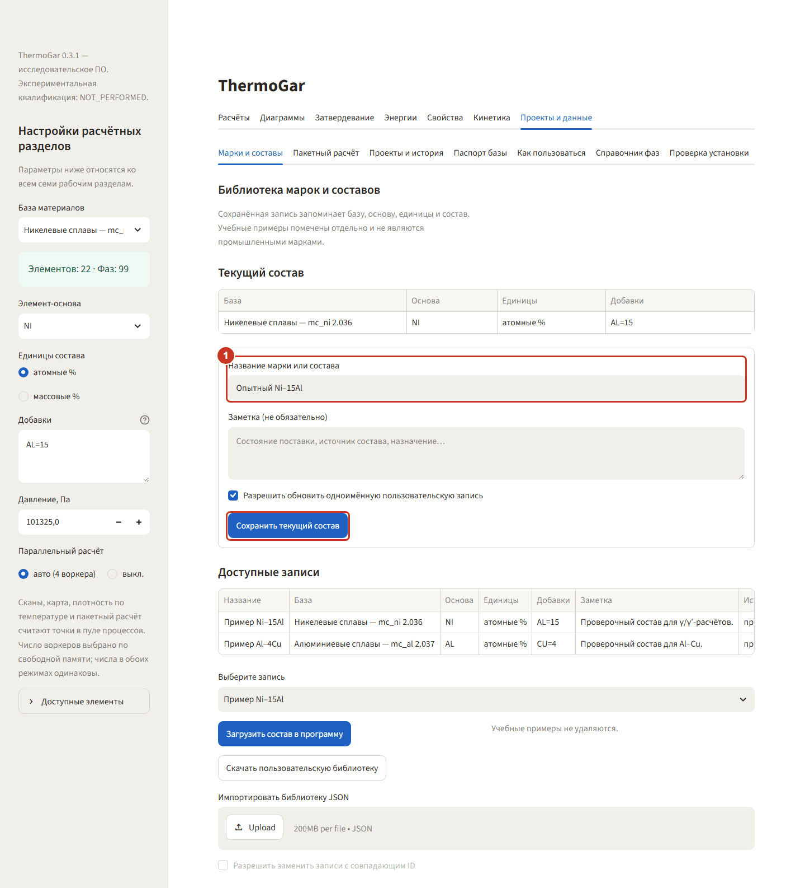
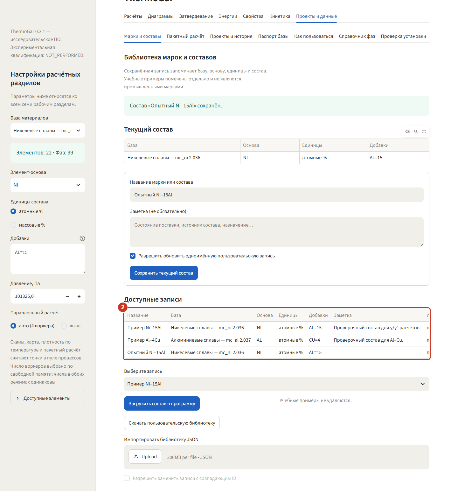
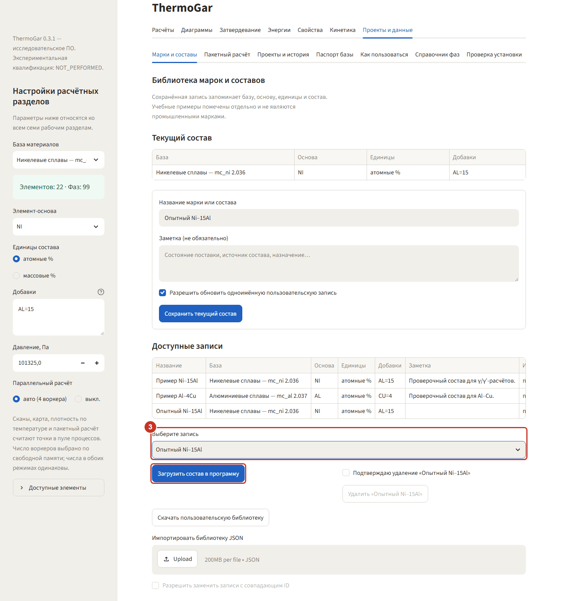
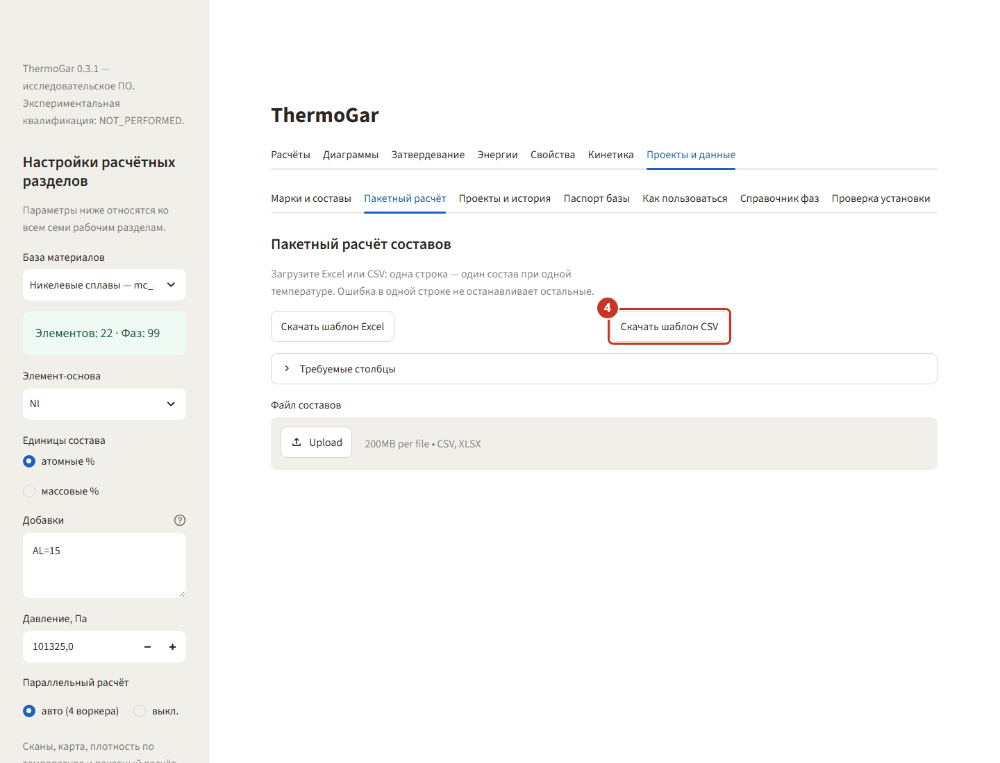
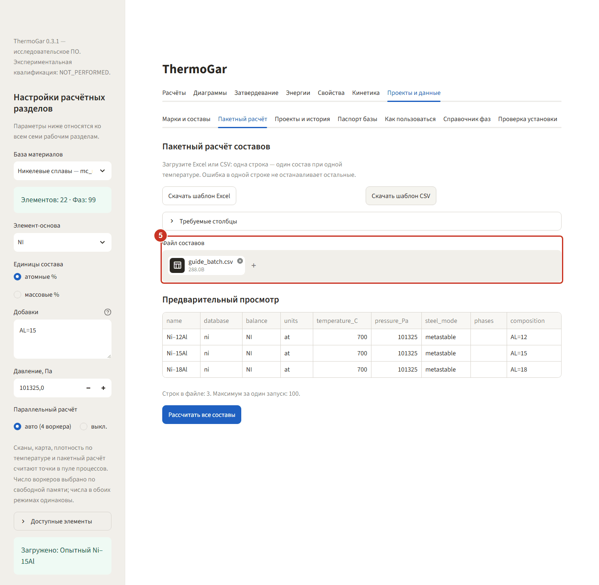
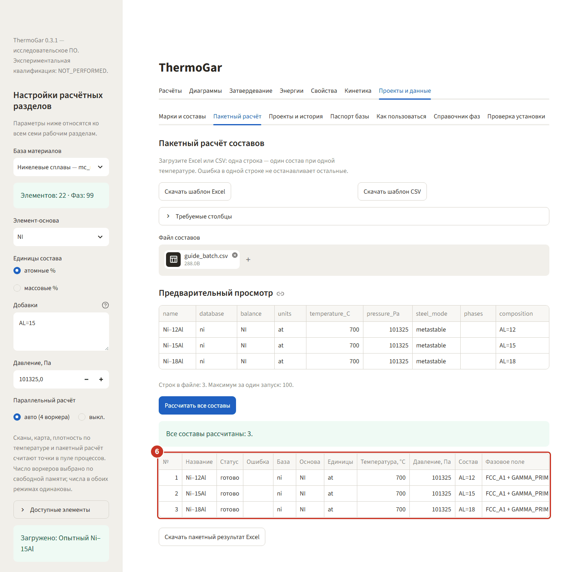
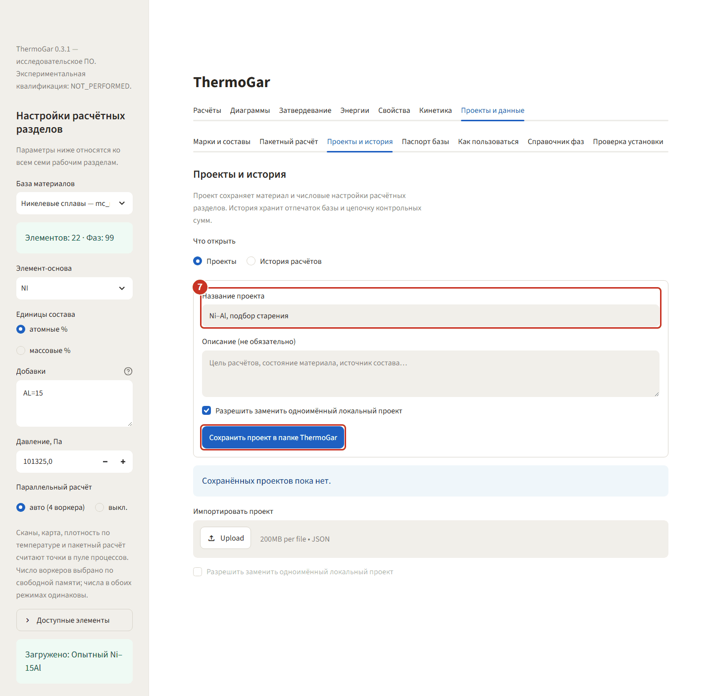
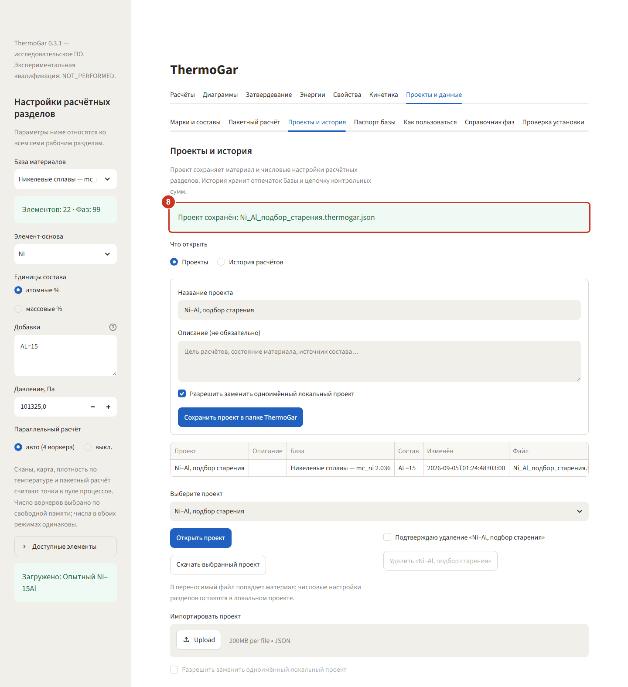

# 7. Проекты и данные — библиотека, пакетный расчёт, проект

Раздел хранит то, что накапливается вокруг расчётов: составы, таблицы для серий, настройки
разделов и историю. Всё пишется в папку ThermoGar в профиле пользователя, не в папку программы.

Пример идёт на никелевой базе с составом `AL=15` (атомные %).

## Библиотека составов

### Шаг 1. Сохраните текущий состав

**«Проекты и данные» → «Марки и составы»**. Сверху показан текущий состав из боковой панели.
Дайте ему имя — например, `Опытный Ni–15Al` — и нажмите **«Сохранить текущий состав»**.
Галочка ниже нужна только если запись с таким именем уже есть.

### Шаг 2. Найдите запись в списке

Запись появится в таблице **«Доступные записи»** рядом с примерами ThermoGar. В столбце
«Источник» видно, что это ваша запись, а не поставляемый пример.

### Шаг 3. Верните состав в работу

Выберите запись и нажмите **«Загрузить состав в программу»**. В боковую панель вернутся база,
основа, единицы и добавки — можно продолжать расчёты с того же материала.

## Пакетный расчёт

### Шаг 4. Скачайте шаблон таблицы

Подвкладка **«Пакетный расчёт»**, кнопка **«Скачать шаблон CSV»** (или Excel). Шаблон содержит
нужные столбцы и две строки-примера. Обязательные столбцы — «Название», «База», «Основа»,
«Единицы», «Температура, °C», «Добавки»; их названия менять нельзя.

### Шаг 5. Загрузите заполненный файл

Заполните шаблон своими строками — здесь три никелевых состава `AL=12`, `AL=15` и `AL=18` при
700 °C — и перетащите файл в поле **«Файл составов»**. Программа покажет предварительный просмотр
и число строк; за один запуск допускается до 100 составов.

### Шаг 6. Рассчитайте всю таблицу

**«Рассчитать все составы»** считает строки в пуле процессов. Ошибка в одной строке не
останавливает остальные: такая строка получит статус с описанием причины, остальные досчитаются.
В сводке по каждой строке — статус, условия расчёта и фазовое поле; доли и составы фаз уходят в
выгрузку **«Скачать пакетный результат Excel»** пятью листами.

## Проект

### Шаг 7. Сохраните проект

Подвкладка **«Проекты и история»**. Проект — это материал плюс числовые настройки всех расчётных
разделов: диапазоны сканов, сетки диаграмм, параметры кинетики. Дайте имя и нажмите
**«Сохранить проект в папке ThermoGar»**.

### Шаг 8. Проверьте, что проект записан

Зелёная полоса называет имя файла. Проект можно выгрузить одним файлом и передать вместе с
отчётом — коллега откроет его и получит ту же постановку задачи. Рядом, на переключателе
**«Что открыть» → «История расчётов»**, лежит журнал всех запусков с контрольной суммой базы.
