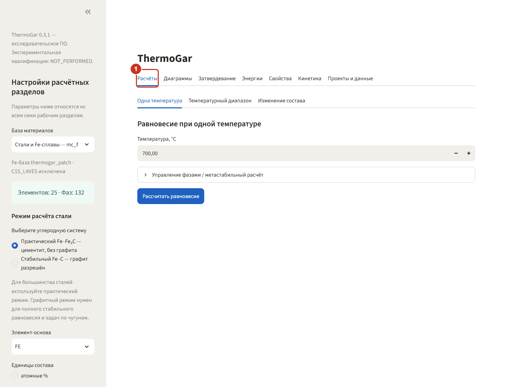
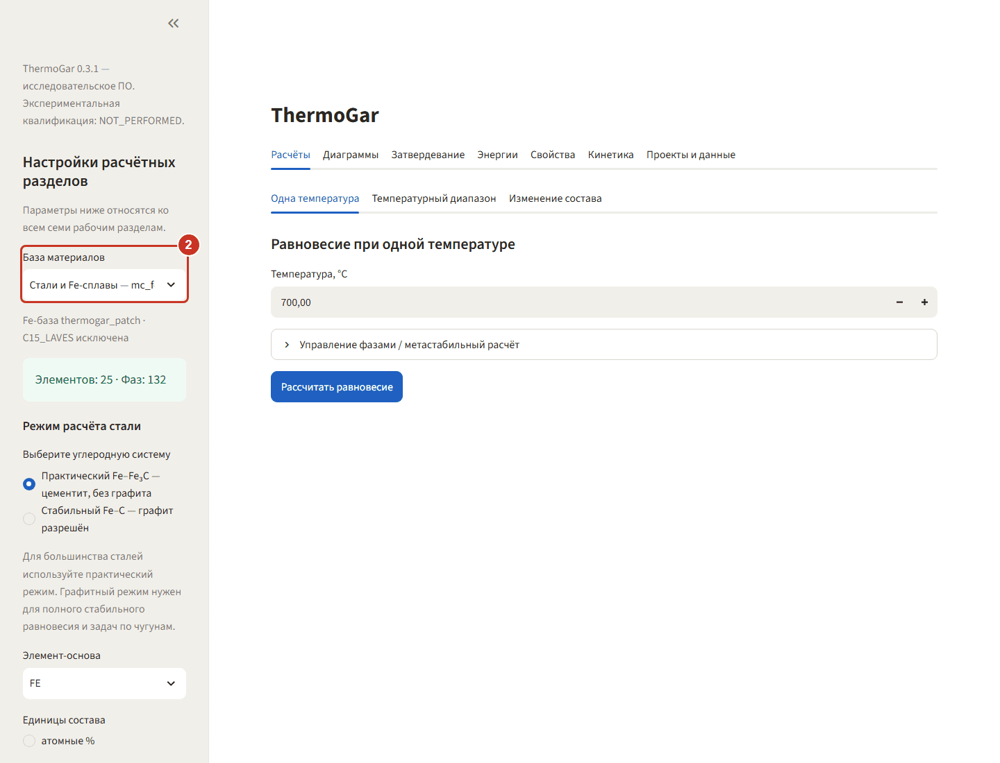
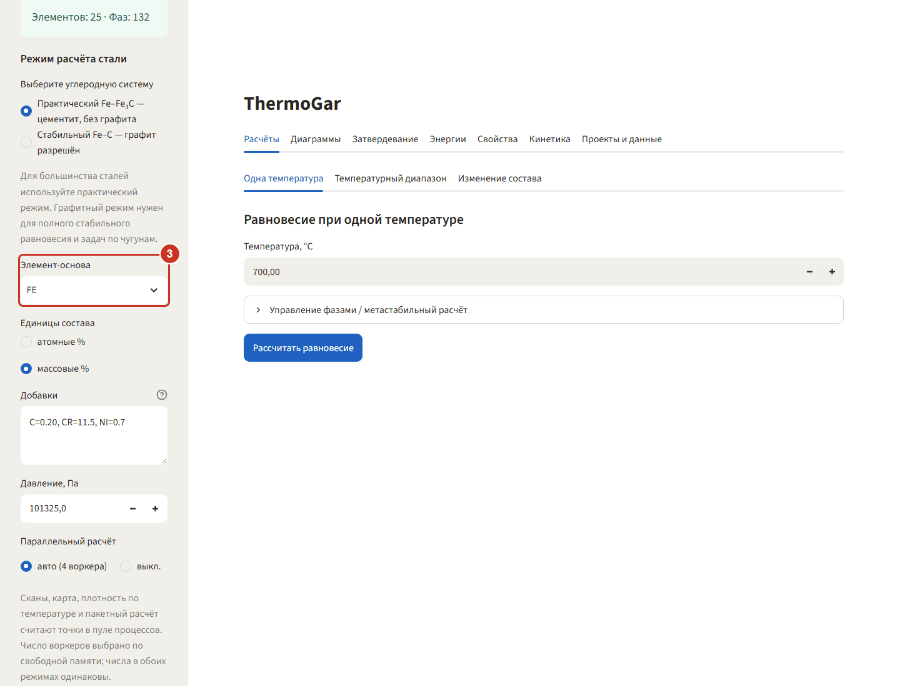
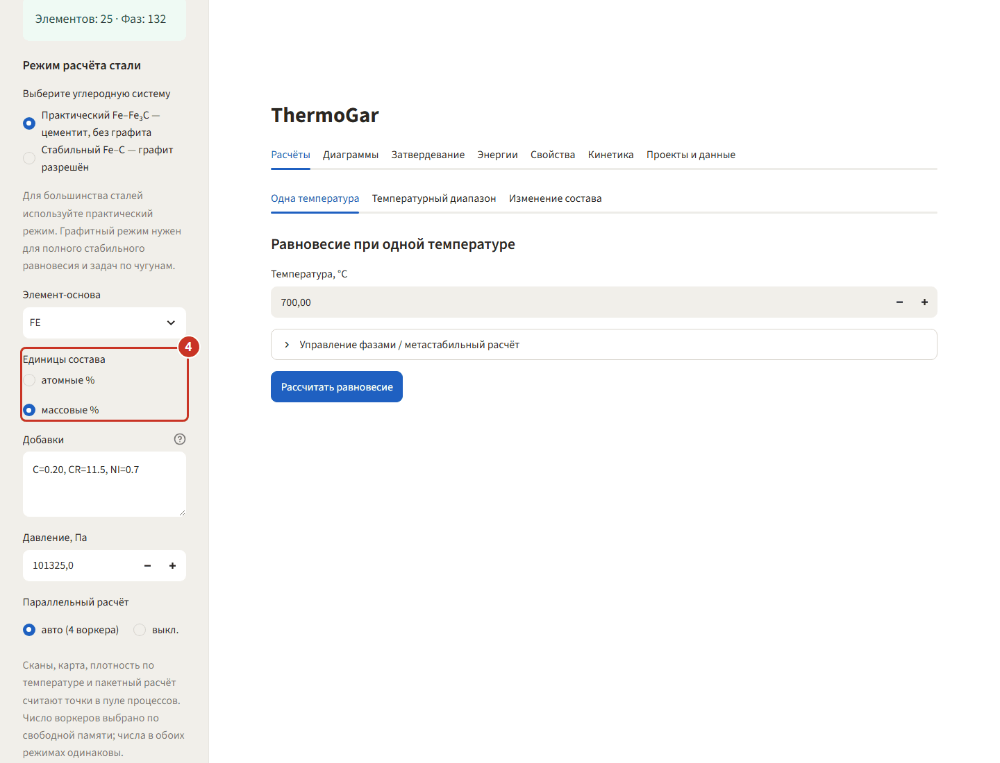
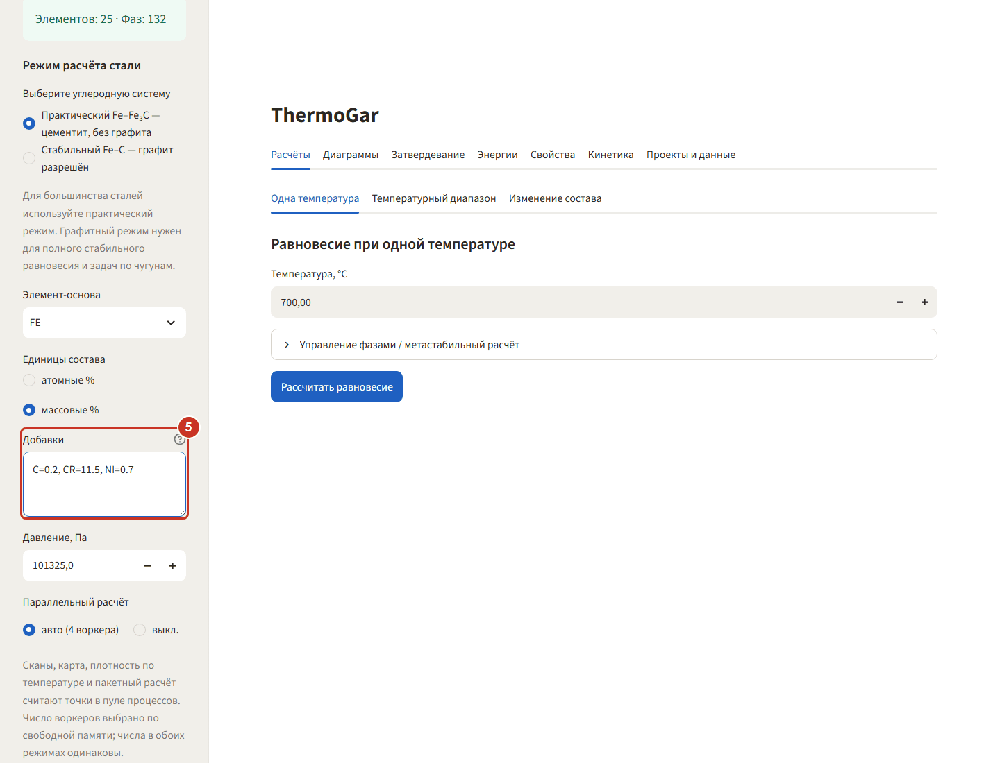
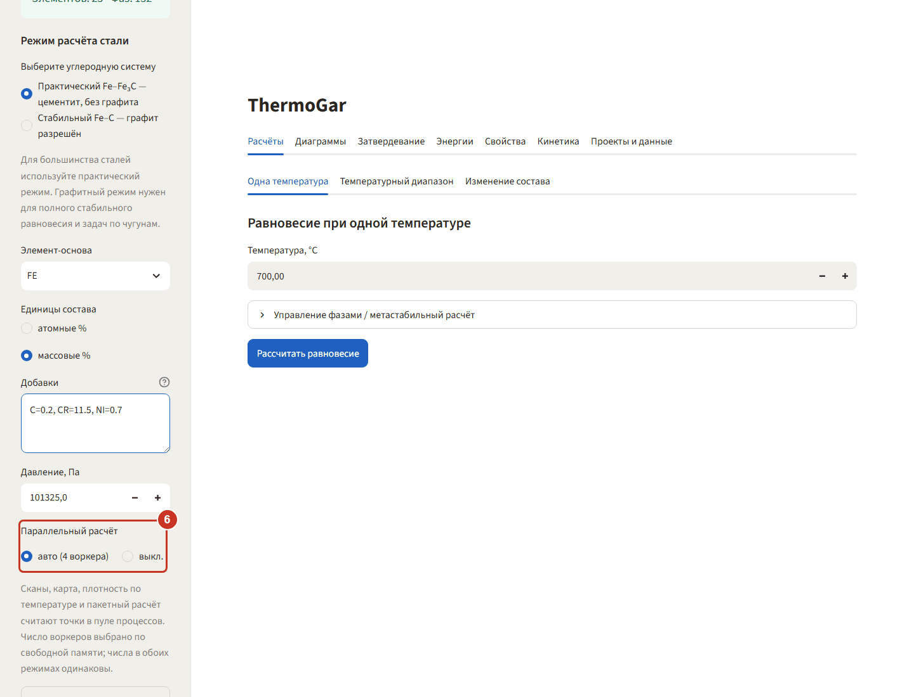
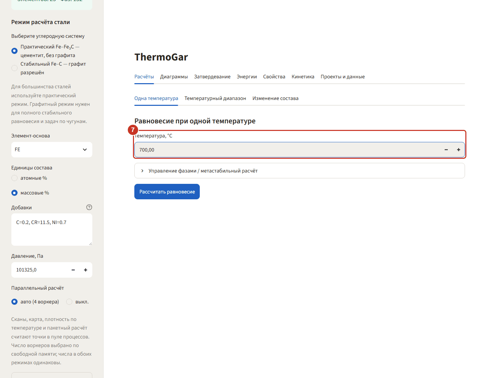

# ThermoGar 0.3.1 — иллюстрированное руководство

Короткие сценарии «сделай так» по каждому из семи разделов программы. На каждом шаге — снимок
экрана, на нём рамкой и номером отмечено, куда нажимать. Составы и числа в примерах взяты из
проверочных расчётов проекта, поэтому у себя вы увидите те же цифры.

Руководство не заменяет [docs/FEATURES.md](../FEATURES.md) — там описано, что программа умеет и
где границы применимости. Здесь показано, как этим пользоваться.

## Оглавление

| Раздел | Пример |
|---|---|
| [Первый запуск](#первый-запуск) | нержавеющая сталь Fe–0,2C–11,5Cr–0,7Ni при 700 °C |
| [1. Расчёты](01-raschety.md) | фазы стали в точке и при нагреве 500–900 °C |
| [2. Диаграммы](02-diagrammy.md) | бинарная диаграмма Ni–Al |
| [3. Затвердевание](03-zatverdevanie.md) | Scheil для Al–4Cu–1Mg |
| [4. Энергии](04-energii.md) | движущая сила выделения γ′ в Ni–15Al |
| [5. Свойства](05-svoystva.md) | плотность стали и модули упругости никелевого сплава |
| [6. Кинетика](06-kinetika.md) | старение γ′ и диффузионная пара Ni–Cr–Al |
| [7. Проекты и данные](07-proekty.md) | библиотека, пакетный расчёт, сохранение проекта |

Всё руководство одной страницей — `ThermoGar_Guide_0.3.1.html` рядом с этим файлом: картинки
встроены внутрь, интернет не нужен.

## Первый запуск

Программа ставится одним установщиком и открывается ярлыком **ThermoGar** на рабочем столе.
Ярлык запускает локальный сервер и открывает окно браузера; интернет при этом не используется.
Первый запуск после установки занимает около 70 секунд, последующие — около 24 секунд.

### Шаг 1. Окно программы

Сверху — семь рабочих разделов, слева — боковая панель с общими настройками. Параметры боковой
панели (база, основа, единицы, состав, давление) действуют сразу на все семь разделов.

### Шаг 2. Выберите базу материалов

В списке **«База материалов»** три базы: никелевая, стальная и алюминиевая. Возьмём
**«Стали и Fe-сплавы — mc_fe 2.062»**. Под списком программа показывает, сколько в базе элементов
и фаз, и напоминает, что фаза C15_LAVES из расчётов исключена.

### Шаг 3. Задайте элемент-основу

**Элемент-основа** — это то, чем добирается остаток до 100 %. Для стали это `FE`: его содержание
вводить не нужно, программа посчитает его сама.

### Шаг 4. Выберите единицы состава

Состав сталей принято задавать в массовых процентах — переключите **«Единицы состава»** на
**массовые %**. Никелевые и алюминиевые примеры в этом руководстве идут в атомных.

### Шаг 5. Введите состав

В поле **«Добавки»** наберите легирующие элементы через запятую: `C=0.2, CR=11.5, NI=0.7`.
Это нержавеющая сталь мартенситного класса; всё остальное — железо.

### Шаг 6. Проверьте параллельный расчёт

**«Параллельный расчёт: авто»** — сканы, карты и пакетный расчёт считаются в несколько процессов.
Число воркеров программа выбирает по свободной памяти. Если параллельный счёт мешает другой
работе на машине, переключите на «выкл.»: числа от этого не меняются, меняется только время.

### Шаг 7. Задайте температуру

Температура задаётся не в боковой панели, а в самом разделе — у каждого расчёта она своя.
На вкладке **«Расчёты» → «Одна температура»** поставьте **700 °C**. Дальше —
[раздел «Расчёты»](01-raschety.md).
